# Documentación Completa - GoProjectSkeleton

## Tabla de Contenidos

1. [Introducción](#introducción)
2. [Arquitectura del Proyecto](#arquitectura-del-proyecto)
3. [Escalabilidad y Serverless](#escalabilidad-y-serverless)
4. [Flujo Completo de Request](#flujo-completo-de-request)
5. [Virtudes y Beneficios](#virtudes-y-beneficios)
6. [Estructura del Proyecto - Capa por Capa](#estructura-del-proyecto---capa-por-capa)
7. [Revisión Exhaustiva por Carpetas](#revisión-exhaustiva-por-carpetas)
8. [Tecnologías y Dependencias](#tecnologías-y-dependencias)
9. [Configuración y Setup](#configuración-y-setup)
10. [Módulos de Negocio](#módulos-de-negocio)
11. [API y Endpoints](#api-y-endpoints)
12. [Base de Datos y Persistencia](#base-de-datos-y-persistencia)
13. [Autenticación y Seguridad](#autenticación-y-seguridad)
14. [Testing](#testing)
15. [Docker y Despliegue](#docker-y-despliegue)
16. [Guía de Desarrollo](#guía-de-desarrollo)

---

## Introducción

**GoProjectSkeleton** es un esqueleto de proyecto Go profesional que implementa **Clean Architecture** y **Arquitectura Hexagonal** (Ports & Adapters). Este proyecto proporciona una base sólida, escalable y mantenible para construir aplicaciones empresariales en Go.

### Filosofía del Proyecto

La filosofía central de **GoProjectSkeleton** es que el **dominio** y la **lógica de aplicación** (business logic) deben ser completamente independientes de la **infraestructura** (frameworks, librerías, bases de datos, etc.). Esto permite:

- **Intercambiabilidad**: Cambiar cualquier componente de infraestructura sin afectar el negocio
- **Testabilidad**: Probar la lógica de negocio sin dependencias externas
- **Escalabilidad**: Migrar a arquitecturas serverless o microservicios sin reescribir código
- **Mantenibilidad**: Código limpio y bien estructurado

### Características Principales

- ✅ **Clean Architecture** - Separación clara de responsabilidades en capas
- ✅ **Arquitectura Hexagonal** - Desacoplamiento total de dependencias externas
- ✅ **Inversión de Dependencias** - Las capas internas no dependen de las externas
- ✅ **Autenticación JWT Completa** - Sistema robusto de autenticación
- ✅ **Gestión de Usuarios** - CRUD completo con validaciones
- ✅ **Sistema de Contraseñas** - Reset y gestión segura de contraseñas
- ✅ **OTP (One-Time Password)** - Autenticación de dos factores
- ✅ **Internacionalización (i18n)** - Soporte multiidioma
- ✅ **Documentación Swagger** - API documentada automáticamente
- ✅ **Testing Completo** - Unitarios, integración y E2E
- ✅ **Docker Completo** - Containerización para desarrollo y producción
- ✅ **Cache con Redis** - Optimización de rendimiento
- ✅ **Sistema de Pipes (DAG)** - Orquestación de casos de uso
- ✅ **Paralelización** - Ejecución concurrente de casos de uso

---

## Arquitectura del Proyecto

### Visión General de la Arquitectura

El proyecto implementa **Clean Architecture** con tres capas principales:

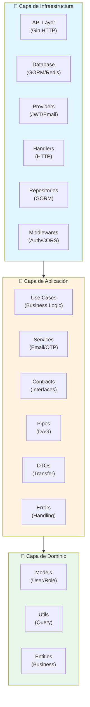

### Diagrama de Arquitectura Hexagonal

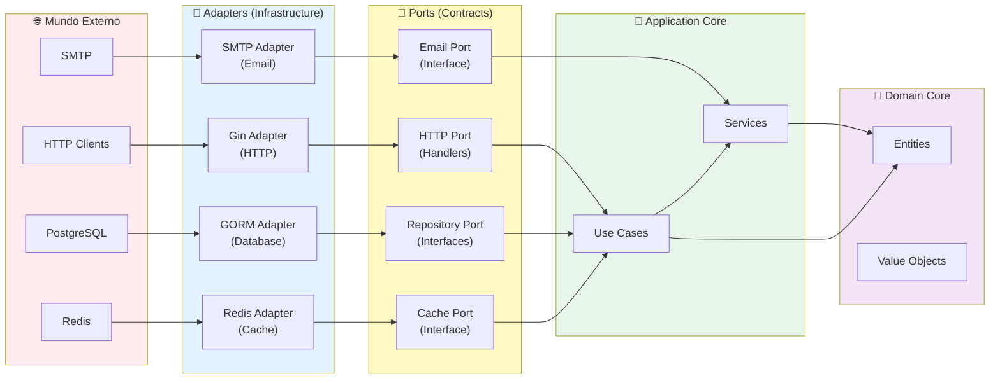

### Principios de Diseño

#### 1. Inversión de Dependencias (Dependency Inversion)

Las capas internas (Domain y Application) **nunca** dependen de las capas externas (Infrastructure). En su lugar, definen **interfaces (contratos)** que la infraestructura implementa.

**Ejemplo:**
```go
// Domain/Application define la interfaz
type IUserRepository interface {
    Create(input UserCreate) (*User, error)
    GetByID(id uint) (*User, error)
}

// Infrastructure implementa la interfaz
type UserRepository struct {
    DB *gorm.DB
}

func (r *UserRepository) Create(input UserCreate) (*User, error) {
    // Implementación con GORM
}
```

#### 2. Separación de Responsabilidades (Separation of Concerns)

Cada capa tiene una responsabilidad única y bien definida:

- **Domain**: Entidades de negocio puras, sin dependencias
- **Application**: Lógica de negocio y casos de uso
- **Infrastructure**: Implementaciones técnicas (HTTP, BD, etc.)

#### 3. Testabilidad

Gracias a las interfaces, podemos testear la lógica de negocio sin necesidad de bases de datos o servicios reales:

```go
// En tests, usamos mocks
mockRepo := &MockUserRepository{}
useCase := NewCreateUserUseCase(logger, mockRepo)
```

#### 4. Extensibilidad

Agregar nuevas funcionalidades es simple y no afecta código existente:

1. Crear modelo en `domain/models/`
2. Definir interfaz en `application/contracts/`
3. Implementar caso de uso en `application/modules/`
4. Crear repositorio en `infrastructure/repositories/`
5. Agregar handler en `infrastructure/handlers/`

### Patrones de Diseño Implementados

#### 1. Repository Pattern

Abstrae el acceso a datos, permitiendo cambiar de base de datos sin afectar la lógica de negocio.

```go
type IUserRepository interface {
    IRepositoryBase[UserCreate, UserUpdate, User, UserInDB]
    CreateWithPassword(input UserAndPasswordCreate) (*User, error)
    GetUserWithRole(id uint) (*UserWithRole, error)
    GetByEmailOrPhone(emailOrPhone string) (*User, error)
}
```

#### 2. Use Case Pattern

Encapsula la lógica de negocio en casos de uso reutilizables y testables.

```go
type CreateUserUseCase struct {
    log  ILoggerProvider
    repo IUserRepository
}

func (uc *CreateUserUseCase) Execute(ctx context.Context, locale LocaleTypeEnum, input UserCreate) *UseCaseResult[User] {
    // Lógica de negocio aquí
}
```

#### 3. DAG (Directed Acyclic Graph) Pattern

Orquesta múltiples casos de uso en secuencia o paralelo.

```go
// Ejecución secuencial
dag := NewDag(NewStep(createUserUC), locale, ctx)
dag = Then(dag, NewStep(sendEmailUC))
result := dag.Execute(input)

// Ejecución paralela
parallelDag := NewUseCaseParallelDag[Input, Output]()
parallelDag.Usecases = []BaseUseCase{uc1, uc2, uc3}
result := parallelDag.Execute(ctx, locale, input)
```

#### 4. Factory Pattern

Crea instancias de casos de uso con dependencias inyectadas.

```go
func NewCreateUserUseCase(
    log ILoggerProvider,
    repo IUserRepository,
) *CreateUserUseCase {
    return &CreateUserUseCase{
        log:  log,
        repo: repo,
    }
}
```

#### 5. Strategy Pattern

Permite intercambiar implementaciones mediante interfaces (providers).

```go
// Interfaz
type IHashProvider interface {
    Hash(password string) (string, error)
    Compare(hashed, plain string) bool
}

// Implementaciones intercambiables
type BcryptHashProvider struct {}
type Argon2HashProvider struct {}
```

---

## Escalabilidad y Serverless

### Capacidades de Escalabilidad

**GoProjectSkeleton** está diseñado para escalar tanto **horizontalmente** como **verticalmente**, y puede migrarse fácilmente a arquitecturas **serverless** o **monolito serverless**.

### Escalabilidad Horizontal

#### Características que Facilitan la Escalabilidad Horizontal

1. **Stateless Design**
   - La aplicación no mantiene estado en memoria
   - Cada request es independiente
   - Perfecto para load balancers

2. **Cache Distribuido (Redis)**
   - Cache compartido entre instancias
   - No hay dependencias de sesión local

3. **Base de Datos Externa**
   - PostgreSQL independiente de la aplicación
   - Múltiples instancias pueden conectarse

4. **Sin Estado de Sesión**
   - Autenticación basada en JWT (stateless)
   - No requiere sticky sessions

#### Implementación para Escalabilidad Horizontal

```go
// Cada handler es stateless
func CreateUser(ctx HandlerContext) {
    // No hay estado compartido
    // Cada request es independiente
    // Puede ejecutarse en cualquier instancia
}
```

### Escalabilidad Vertical

#### Optimizaciones Implementadas

1. **Goroutines Nativas**
   - Concurrencia eficiente de Go
   - Múltiples requests procesados simultáneamente

2. **Connection Pooling**
   - Reutilización de conexiones a BD
   - Configuración optimizada de GORM

3. **Cache Inteligente**
   - Reduce consultas a base de datos
   - TTL configurable

4. **Query Optimization**
   - Filtros y ordenamiento eficientes
   - Paginación para control de memoria

### Migración a Monolito Serverless

**GoProjectSkeleton** puede migrarse fácilmente a una arquitectura **monolito serverless** (como AWS Lambda, Google Cloud Functions, Azure Functions) gracias a:

#### 1. Arquitectura Desacoplada

```go
// La lógica de negocio no depende de Gin
type CreateUserUseCase struct {
    // No hay referencias a HTTP
    // Solo interfaces
}
```

#### 2. Inicialización Modular

```go
// container.go - Inicialización separada
func Initialize() {
    // Configuración
    // Base de datos
    // Providers
    // Servicios
}
```

#### 3. Handlers Independientes

Los handlers pueden adaptarse fácilmente a diferentes frameworks o entornos serverless:

```go
// Handler actual (Gin)
func CreateUser(ctx HandlerContext) { ... }

// Adaptación para Lambda
func CreateUserLambda(ctx context.Context, event APIGatewayEvent) (Response, error) {
    // Misma lógica, diferente wrapper
}
```

#### 4. Sin Estado Global

- No hay variables globales de estado
- Todo se pasa por contexto o inyección de dependencias

#### Pasos para Migración Serverless

1. **Extraer Lógica de Negocio**
   ```go
   // Ya está hecho - los Use Cases son independientes
   ```

2. **Crear Adapter para Serverless**
   ```go
   // lambda/handlers/user.go
   func CreateUserHandler(ctx context.Context, event events.APIGatewayProxyRequest) (events.APIGatewayProxyResponse, error) {
       // Inicializar infraestructura
       infrastructure.Initialize()
       
       // Adaptar evento a DTO
       var userCreate dtos.UserCreate
       json.Unmarshal([]byte(event.Body), &userCreate)
       
       // Ejecutar caso de uso (mismo código)
       ucResult := usecases_user.NewCreateUserUseCase(...).Execute(...)
       
       // Adaptar respuesta
       return adaptResponse(ucResult), nil
   }
   ```

3. **Configurar Variables de Entorno**
   - Usar el mismo sistema de configuración
   - Adaptar a variables de entorno del proveedor cloud

4. **Mantener Misma Lógica**
   - Los Use Cases no cambian
   - Los Repositories no cambian
   - Solo cambia la capa de infraestructura HTTP

### Escalabilidad en Producción

#### Diagrama de Escalabilidad Horizontal

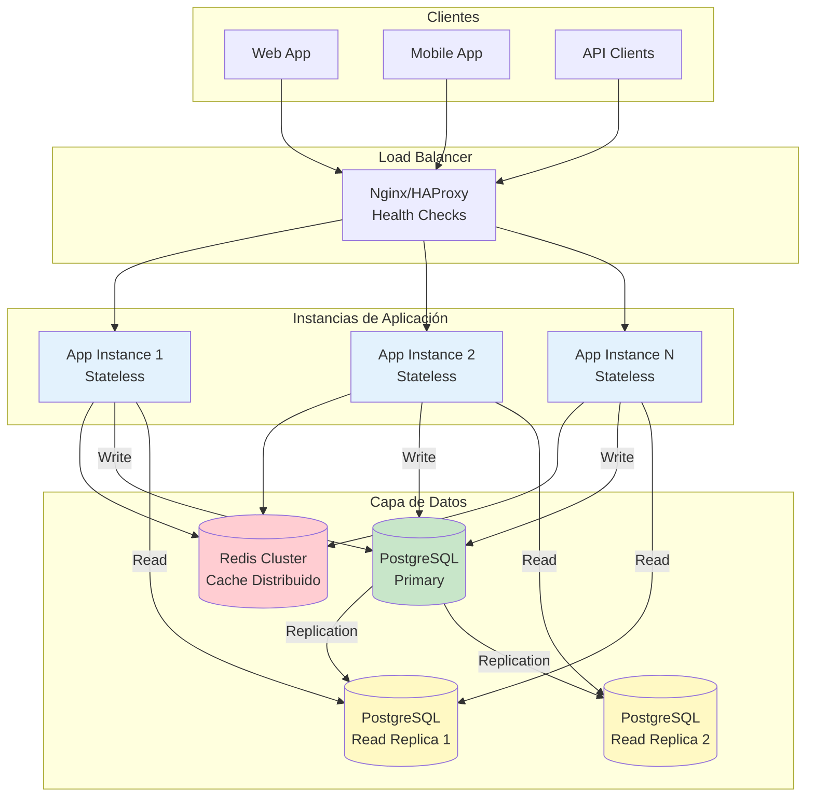

#### Configuración Recomendada

1. **Load Balancer**
   - Distribuir tráfico entre múltiples instancias
   - Health checks en `/api/health-check`

2. **Base de Datos**
   - Read replicas para consultas
   - Connection pooling optimizado
   - Índices en columnas frecuentes

3. **Cache**
   - Redis cluster para alta disponibilidad
   - Estrategias de cache (cache-aside, write-through)

4. **Monitoring**
   - Métricas de rendimiento
   - Logging estructurado
   - Alertas de errores

---

## Flujo Completo de Request

### Diagrama de Flujo de Request

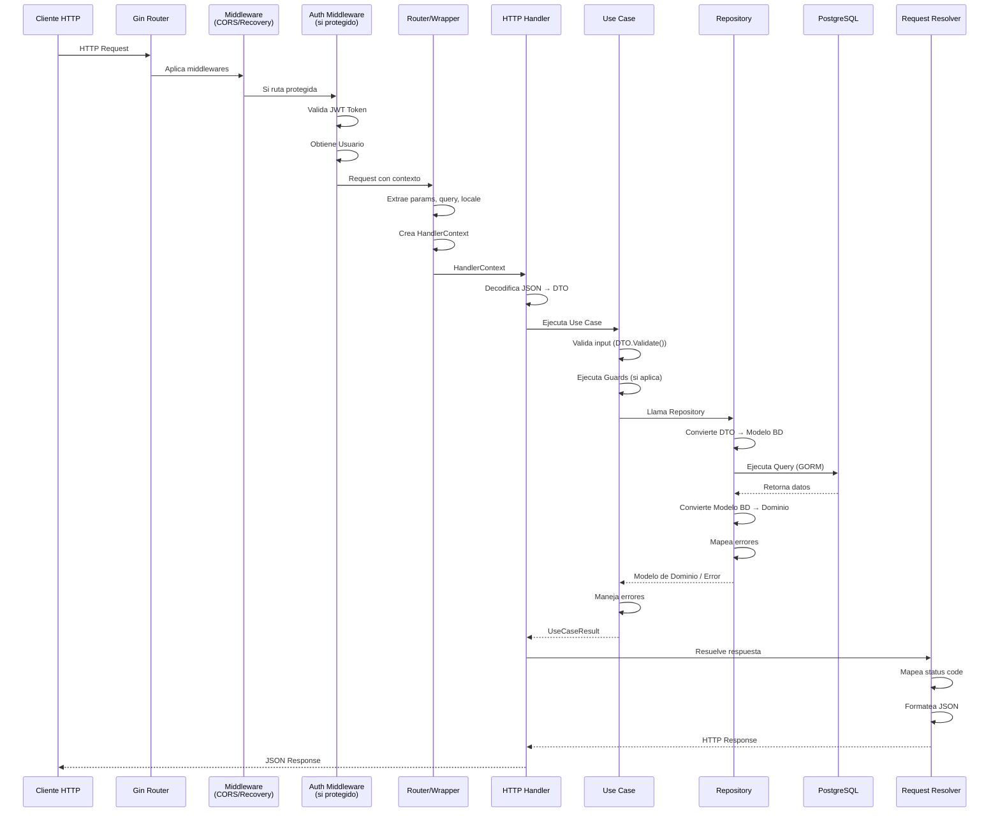

### Diagrama de Flujo Simplificado

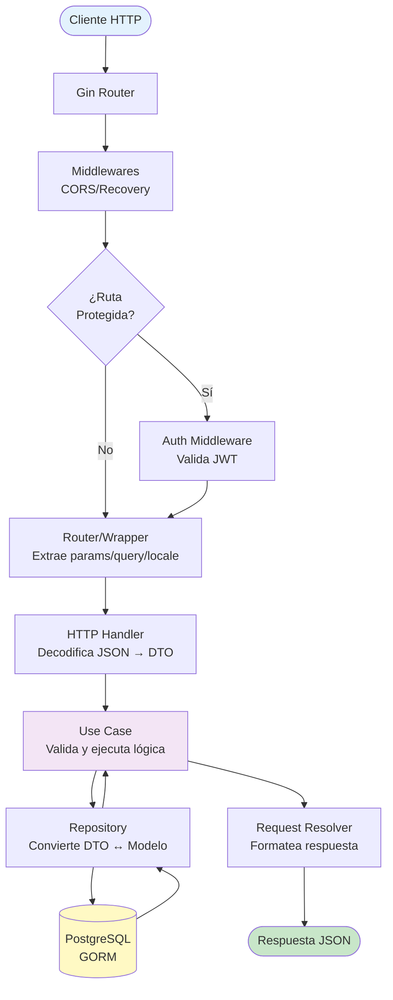

### Flujo Detallado con Código

#### 1. Entrada HTTP (main.go)

```go
// main.go
func main() {
    infrastructure.Initialize()  // Inicializa BD, providers, etc.
    app := buildGinApp()         // Crea aplicación Gin
    loadGinApp(app)               // Configura middlewares y rutas
    app.Run("0.0.0.0:8080")      // Inicia servidor
}
```

#### 2. Ruteo (routes/router.go)

```go
// routes/router.go
func Router(r *gin.RouterGroup) {
    r.POST("/user", wrapHandler(handlers.CreateUser))
    // wrapHandler adapta Gin a HandlerContext
}
```

#### 3. Wrapper (routes/wrap.go)

```go
// routes/wrap.go
func wrapHandler(h func(handlers.HandlerContext)) gin.HandlerFunc {
    return func(c *gin.Context) {
        locale := c.GetHeader("Accept-Language")
        params := extractParams(c)
        query := extractQuery(c)
        
        hContext := handlers.NewHandlerContext(
            c.Request.Context(),
            &locale,
            params,
            &c.Request.Body,
            query,
            c.Writer,
        )
        h(hContext)
    }
}
```

#### 4. Handler (handlers/user.go)

```go
// handlers/user.go
func CreateUser(ctx HandlerContext) {
    // 1. Decodificar JSON
    var userCreate dtos.UserCreate
    json.NewDecoder(*ctx.Body).Decode(&userCreate)
    
    // 2. Crear repositorio
    repo := repositories.NewUserRepository(database.DB, providers.Logger)
    
    // 3. Crear y ejecutar caso de uso
    ucResult := usecases_user.NewCreateUserUseCase(
        providers.Logger,
        repo,
    ).Execute(ctx.c, ctx.Locale, userCreate)
    
    // 4. Resolver respuesta
    headers := map[HTTPHeaderTypeEnum]string{
        CONTENT_TYPE: string(APPLICATION_JSON),
    }
    NewRequestResolver[models.User]().ResolveDTO(
        ctx.ResponseWriter,
        ucResult,
        headers,
    )
}
```

#### 5. Caso de Uso (application/modules/user/use_cases/create_user.go)

```go
// application/modules/user/use_cases/create_user.go
func (uc *CreateUserUseCase) Execute(
    ctx context.Context,
    locale locales.LocaleTypeEnum,
    input dtos.UserCreate,
) *usecase.UseCaseResult[models.User] {
    result := usecase.NewUseCaseResult[models.User]()
    
    // 1. Validar input
    uc.validate(input, result)
    if result.HasError() {
        return result
    }
    
    // 2. Llamar a repositorio
    res, err := uc.repo.Create(input)
    if err != nil {
        result.SetError(err.Code, err.Context)
        return result
    }
    
    // 3. Retornar éxito
    result.SetData(status.Created, *res, "User created")
    return result
}
```

#### 6. Repositorio (infrastructure/repositories/user.go)

```go
// infrastructure/repositories/user.go
func (ur *UserRepository) Create(input dtos.UserCreate) (*models.User, *application_errors.ApplicationError) {
    // 1. Convertir DTO a modelo GORM
    userCreate := ur.modelConverter.ToGormCreate(input)
    
    // 2. Ejecutar query
    if err := ur.DB.Create(userCreate).Error; err != nil {
        return nil, MapOrmError(err)  // Mapea errores de BD
    }
    
    // 3. Convertir modelo GORM a modelo de dominio
    userModel := ur.modelConverter.ToDomain(userCreate)
    return userModel, nil
}
```

#### 7. Resolución de Respuesta (handlers/request_resolver.go)

```go
// handlers/request_resolver.go
func (rr *RequestResolver[D]) ResolveDTO(
    w http.ResponseWriter,
    result *usecase.UseCaseResult[D],
    headersToAdd map[HTTPHeaderTypeEnum]string,
) {
    // 1. Agregar headers
    rr.setHeaders(w, headersToAdd)
    
    // 2. Manejar errores
    if result.HasError() {
        w.WriteHeader(rr.statusMapping[result.StatusCode])
        json.NewEncoder(w).Encode(map[string]any{
            "details": result.Error,
        })
        return
    }
    
    // 3. Respuesta exitosa
    w.WriteHeader(rr.statusMapping[result.StatusCode])
    json.NewEncoder(w).Encode(map[string]any{
        "data":    result.Data,
        "details": result.Details,
    })
}
```

### Flujo con Pipes (DAG)

Para casos más complejos que requieren múltiples pasos:

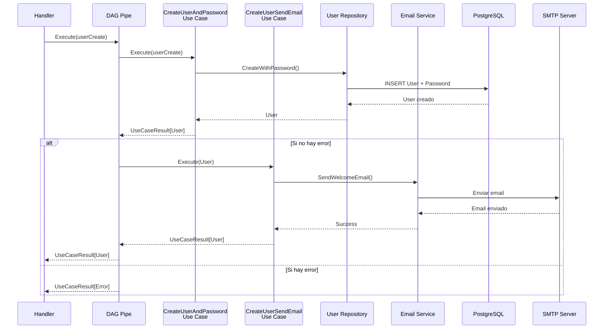

#### Diagrama de DAG (Directed Acyclic Graph)


#### Ejecución Paralela con DAG

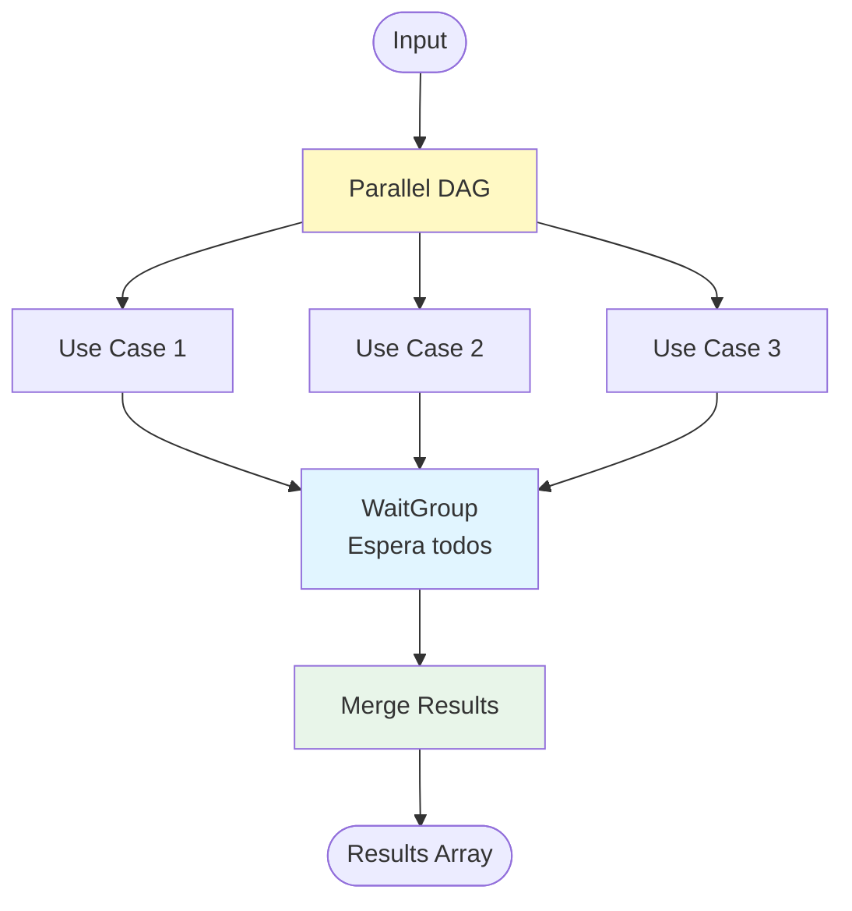

**Código de ejemplo:**

```go
// Ejemplo: Crear usuario y enviar email
func CreateUserAndPassword(ctx HandlerContext) {
    // 1. Crear casos de uso
    uc_create_user_password := usecases_user.NewCreateUserAndPasswordUseCase(...)
    uc_create_user_email := usecases_user.NewCreateUserSendEmailUseCase(...)
    
    // 2. Crear pipe (DAG)
    pipe := user_pipes.NewCreateUserPipe(
        ctx.c,
        ctx.Locale,
        uc_create_user_password,
        uc_create_user_email,
    )
    
    // 3. Ejecutar pipe (ejecuta secuencialmente)
    ucResult := pipe.Execute(userCreate)
    
    // 4. Resolver respuesta
    NewRequestResolver[models.User]().ResolveDTO(...)
}
```

El DAG ejecuta:
1. `CreateUserAndPasswordUseCase` → retorna `User`
2. `CreateUserSendEmailUseCase` → recibe `User`, envía email, retorna `User`

---

## Virtudes y Beneficios

### 1. Arquitectura Sólida y Escalable

#### ✅ Clean Architecture
- **Separación clara de responsabilidades**: Cada capa tiene un propósito específico
- **Independencia de frameworks**: Puedes cambiar Gin por otro framework sin afectar el negocio
- **Testabilidad**: Fácil de testear cada capa independientemente

#### ✅ Arquitectura Hexagonal
- **Desacoplamiento total**: La lógica de negocio no conoce detalles de implementación
- **Ports & Adapters**: Interfaces claras entre capas
- **Flexibilidad**: Cambiar base de datos, proveedores, etc. sin reescribir código

### 2. Productividad del Desarrollador

#### ✅ Estructura Clara
- **Organización lógica**: Fácil encontrar código
- **Convenciones consistentes**: Mismo patrón en todo el proyecto
- **Onboarding rápido**: Nuevos desarrolladores entienden rápido

#### ✅ Reutilización
- **Componentes compartidos**: DTOs, errores, validaciones reutilizables
- **Base de repositorios**: `RepositoryBase` reduce código duplicado
- **Providers intercambiables**: Cambiar implementaciones fácilmente

### 3. Mantenibilidad

#### ✅ Código Limpio
- **Principios SOLID**: Aplicados consistentemente
- **DRY (Don't Repeat Yourself)**: Mínima duplicación
- **Nombres descriptivos**: Código auto-documentado

#### ✅ Extensibilidad
- **Agregar funcionalidades**: Sin modificar código existente
- **Módulos independientes**: Cada módulo es autocontenido
- **Interfaces bien definidas**: Contratos claros

### 4. Testabilidad

#### ✅ Testing en Capas
- **Unit tests**: Casos de uso testables con mocks
- **Integration tests**: Tests con base de datos real
- **E2E tests**: Tests completos del flujo

#### ✅ Mocks Completos
- **Mocks de repositorios**: Fácil simular datos
- **Mocks de providers**: Simular servicios externos
- **Testing aislado**: Sin dependencias externas

### 5. Seguridad

#### ✅ Autenticación Robusta
- **JWT completo**: Access y refresh tokens
- **OTP (2FA)**: Autenticación de dos factores
- **Hash seguro**: Bcrypt para contraseñas

#### ✅ Validación
- **Validación en múltiples capas**: DTOs, casos de uso, repositorios
- **Sanitización**: Prevención de inyecciones
- **Guards**: Control de acceso basado en roles

### 6. Rendimiento

#### ✅ Optimizaciones
- **Cache con Redis**: Reduce consultas a BD
- **Connection pooling**: Reutilización de conexiones
- **Goroutines**: Concurrencia nativa de Go
- **Query optimization**: Filtros y paginación eficientes

### 7. Internacionalización

#### ✅ Multiidioma
- **Soporte i18n**: Mensajes en múltiples idiomas
- **Locale por request**: Cada request puede tener su idioma
- **Mensajes centralizados**: Fácil agregar nuevos idiomas

### 8. Documentación

#### ✅ Swagger Automático
- **API documentada**: Endpoints documentados automáticamente
- **Ejemplos**: Ejemplos de requests y responses
- **Tipos claros**: Esquemas bien definidos

### 9. DevOps y Despliegue

#### ✅ Docker Completo
- **Multi-servicio**: Aplicación, BD, Redis, etc.
- **Entornos separados**: Dev, test, E2E
- **Hot reload**: Desarrollo eficiente

#### ✅ Configuración Flexible
- **Variables de entorno**: Configuración por ambiente
- **Settings centralizados**: Un solo lugar para configuración
- **Validación**: Validación de configuración al inicio

### 10. Escalabilidad

#### ✅ Horizontal
- **Stateless**: Listo para load balancers
- **Cache distribuido**: Redis compartido
- **Sin sesiones**: JWT stateless

#### ✅ Vertical
- **Goroutines**: Concurrencia eficiente
- **Optimizaciones**: Cache, pooling, etc.
- **Serverless ready**: Fácil migración a serverless

### Beneficios para Iniciar un Proyecto

1. **Ahorro de Tiempo**
   - Estructura lista para usar
   - Patrones implementados
   - No empezar desde cero

2. **Mejores Prácticas**
   - Arquitectura probada
   - Patrones de diseño aplicados
   - Código de calidad

3. **Escalabilidad Garantizada**
   - Diseñado para crecer
   - Fácil agregar funcionalidades
   - Listo para producción

4. **Mantenibilidad a Largo Plazo**
   - Código organizado
   - Fácil de entender
   - Fácil de modificar

5. **Equipo Productivo**
   - Onboarding rápido
   - Convenciones claras
   - Menos bugs

---

## Estructura del Proyecto - Capa por Capa

### Visión General de la Estructura

```
GoProjectSkeleton/
├── src/
│   ├── domain/              # Capa de Dominio (Núcleo)
│   ├── application/         # Capa de Aplicación (Lógica de Negocio)
│   └── infrastructure/     # Capa de Infraestructura (Detalles Técnicos)
├── docker/                  # Configuración Docker
├── tests/                   # Tests del proyecto
├── docs/                    # Documentación Swagger
└── IDE/                     # Configuración del IDE
```

### Capa 1: Domain (Dominio)

**Responsabilidad**: Contiene las entidades de negocio puras, sin dependencias externas.

```
domain/
├── models/                  # Modelos de dominio
│   ├── user.go             # Entidad User
│   ├── role.go             # Entidad Role
│   ├── password.go         # Entidad Password
│   ├── one_time_password.go
│   ├── one_time_token.go
│   └── status.go
└── utils/                   # Utilidades de dominio
    └── query_payload.go    # Utilidades para queries
```

#### Características

- **Sin dependencias externas**: No importa frameworks, BD, etc.
- **Entidades puras**: Solo lógica de negocio
- **Validaciones de dominio**: Reglas de negocio en los modelos
- **Inmutabilidad preferida**: Modelos inmutables cuando es posible

#### Ejemplo: Modelo User

```go
// domain/models/user.go
type UserBase struct {
    Name     string `json:"name"`
    Email    string `json:"email"`
    Phone    string `json:"phone"`
    Status   string `json:"status"`
    RoleID   uint   `json:"role_id"`
    OTPLogin bool   `json:"otp_login"`
}

func (u UserBase) Validate() []string {
    var errs []string
    if u.Name == "" {
        errs = append(errs, "name is required")
    }
    // Más validaciones...
    return errs
}
```

### Capa 2: Application (Aplicación)

**Responsabilidad**: Contiene la lógica de negocio y casos de uso.

```
application/
├── contracts/               # Contratos (Interfaces)
│   ├── providers/          # Interfaces de proveedores
│   │   ├── cache_provider.go
│   │   ├── email_provider.go
│   │   ├── hash_provider.go
│   │   ├── jwt_provider.go
│   │   └── logger_provider.go
│   └── repositories/       # Interfaces de repositorios
│       ├── user.go
│       ├── password.go
│       └── role.go
├── modules/                # Módulos de negocio
│   ├── auth/              # Módulo de autenticación
│   ├── user/              # Módulo de usuarios
│   ├── password/          # Módulo de contraseñas
│   └── status/            # Módulo de estado
└── shared/                # Componentes compartidos
    ├── DTOs/              # Data Transfer Objects
    ├── errors/            # Manejo de errores
    ├── services/          # Servicios compartidos
    ├── templates/         # Plantillas (emails)
    ├── use_case/          # Base de casos de uso
    ├── context/           # Contexto de aplicación
    ├── locales/           # Internacionalización
    ├── settings/          # Configuración de aplicación
    └── guards/            # Guards de autorización
```

#### Características

- **Casos de uso**: Cada funcionalidad es un caso de uso
- **Interfaces**: Define contratos que la infraestructura implementa
- **DTOs**: Objetos de transferencia de datos
- **Servicios**: Lógica compartida entre módulos

#### Ejemplo: Caso de Uso

```go
// application/modules/user/use_cases/create_user.go
type CreateUserUseCase struct {
    log  ILoggerProvider
    repo IUserRepository
}

func (uc *CreateUserUseCase) Execute(
    ctx context.Context,
    locale LocaleTypeEnum,
    input UserCreate,
) *UseCaseResult[User] {
    // 1. Validar
    // 2. Ejecutar lógica de negocio
    // 3. Llamar a repositorio
    // 4. Retornar resultado
}
```

### Capa 3: Infrastructure (Infraestructura)

**Responsabilidad**: Implementaciones técnicas (HTTP, BD, etc.).

```
infrastructure/
├── api/                    # Capa de API HTTP
│   ├── cmd/
│   │   └── main.go        # Punto de entrada
│   ├── routes/            # Definición de rutas
│   ├── middlewares/       # Middlewares HTTP
│   └── types.go
├── config/                # Configuración
│   ├── config.go         # Carga de configuración
│   └── env.go            # Variables de entorno
├── database/              # Base de datos
│   └── gormgoskeleton/   # Implementación GORM
│       ├── models/       # Modelos de BD
│       └── init_db/      # Inicialización
├── handlers/              # Handlers HTTP
│   ├── user.go
│   ├── auth.go
│   ├── password.go
│   └── status.go
├── providers/            # Implementaciones de proveedores
│   ├── jwt_provider.go
│   ├── hash_provider.go
│   ├── email_provider.go
│   └── cache_provider.go
└── repositories/          # Implementaciones de repositorios
    ├── user.go
    ├── password.go
    └── role.go
```

#### Características

- **Implementaciones concretas**: GORM, Gin, Redis, etc.
- **Adaptadores**: Adaptan frameworks a interfaces
- **Configuración**: Carga de configuración desde variables de entorno

#### Ejemplo: Repositorio

```go
// infrastructure/repositories/user.go
type UserRepository struct {
    RepositoryBase[UserCreate, UserUpdate, User, dbModels.User]
    DB *gorm.DB
}

func (r *UserRepository) Create(input UserCreate) (*User, error) {
    // Implementación con GORM
}
```

---

## Revisión Exhaustiva por Carpetas

### `/src/domain/` - Capa de Dominio

#### `/src/domain/models/`

Contiene todas las entidades de dominio puras.

**Archivos principales:**

- **`user.go`**: Entidad User con validaciones de dominio
  - `UserBase`: Estructura base del usuario
  - `User`: Usuario con metadatos de BD
  - `UserWithRole`: Usuario con información de rol
  - `Validate()`: Validaciones de negocio

- **`role.go`**: Entidad Role
  - Define roles del sistema
  - Prioridades y permisos

- **`password.go`**: Entidad Password
  - Hash de contraseñas
  - Expiración
  - Validación de fortaleza

- **`one_time_password.go`**: OTP para autenticación
  - Generación de códigos
  - TTL y expiración

- **`one_time_token.go`**: Tokens de un solo uso
  - Para reset de contraseña
  - Para activación de cuenta

- **`status.go`**: Estados del sistema
  - Estados de usuarios
  - Estados de aplicación

- **`db_models_base.go`**: Base para modelos con metadatos de BD
  - ID, CreatedAt, UpdatedAt, DeletedAt

- **`models_utils.go`**: Utilidades para modelos
  - Validación de email
  - Validación de contraseña

#### `/src/domain/utils/`

Utilidades de dominio.

- **`query_payload.go`**: Construcción de queries
  - Filtros
  - Ordenamiento
  - Paginación

### `/src/application/` - Capa de Aplicación

#### `/src/application/contracts/`

Define todas las interfaces (contratos) que la infraestructura debe implementar.

##### `/src/application/contracts/providers/`

Interfaces de proveedores externos:

- **`cache_provider.go`**: Interfaz para cache (Redis)
  - `Get()`, `Set()`, `Delete()`, `Exists()`

- **`email_provider.go`**: Interfaz para envío de emails
  - `SendEmail()`

- **`hash_provider.go`**: Interfaz para hashing
  - `Hash()`, `Compare()`

- **`jwt_provider.go`**: Interfaz para JWT
  - `GenerateAccessToken()`, `GenerateRefreshToken()`, `ParseTokenAndValidate()`

- **`logger_provider.go`**: Interfaz para logging
  - `Info()`, `Error()`, `Debug()`, `Panic()`

- **`renderer_provider.go`**: Interfaz para renderizado de templates
  - `Render()`

- **`status_provider.go`**: Interfaz para estado del sistema

##### `/src/application/contracts/repositories/`

Interfaces de repositorios:

- **`base.go`**: Interfaz base para repositorios
  - `Create()`, `GetByID()`, `Update()`, `Delete()`, `GetAll()`

- **`user.go`**: Interfaz específica de usuarios
  - `CreateWithPassword()`, `GetUserWithRole()`, `GetByEmailOrPhone()`

- **`password.go`**: Interfaz de contraseñas
  - `GetActivePassword()`, `Create()`

- **`role.go`**: Interfaz de roles
  - `GetByKey()`, `GetAll()`

- **`one_time_password.go`**: Interfaz de OTP
  - `Create()`, `GetByCode()`, `Invalidate()`

- **`one_time_token.go`**: Interfaz de tokens
  - `Create()`, `GetByToken()`, `Invalidate()`

#### `/src/application/modules/`

Módulos de negocio organizados por dominio.

##### `/src/application/modules/auth/`

Módulo de autenticación:

- **`jwt_auth.go`**: Autenticación con JWT
  - Login con email/contraseña
  - Generación de tokens

- **`jwt_auth_refresh.go`**: Refresh de tokens
  - Renovación de access token

- **`jwt_auth_otp.go`**: Autenticación con OTP
  - Login con código OTP

- **`jwt_auth_user.go`**: Autenticación de usuario desde token
  - Validación de token
  - Obtención de usuario

- **`get_reset_password_token.go`**: Generación de token de reset
  - Creación de token
  - Envío de email

- **`get_reset_password_token_email.go`**: Envío de email de reset

- **`pipe/get_reset_password.go`**: Pipe para reset de contraseña
  - Orquesta generación de token y envío de email

##### `/src/application/modules/user/`

Módulo de usuarios:

- **`use_cases/create_user.go`**: Crear usuario
- **`use_cases/create_user_password.go`**: Crear usuario con contraseña
- **`use_cases/create_user_email.go`**: Enviar email de bienvenida
- **`use_cases/get_user.go`**: Obtener usuario
- **`use_cases/get_all_user.go`**: Listar usuarios (con cache)
- **`use_cases/update_user.go`**: Actualizar usuario
- **`use_cases/delete_user.go`**: Eliminar usuario
- **`use_cases/activate_user.go`**: Activar usuario
- **`pipes/create_user.go`**: Pipe para crear usuario y enviar email

##### `/src/application/modules/password/`

Módulo de contraseñas:

- **`use_cases/create_password.go`**: Crear contraseña
- **`use_cases/create_password_token.go`**: Crear token de reset
- **`pipes/create_password_token.go`**: Pipe para reset

##### `/src/application/modules/status/`

Módulo de estado:

- **`use_cases/status.go`**: Health check del sistema

#### `/src/application/shared/`

Componentes compartidos entre módulos.

##### `/src/application/shared/DTOs/`

Data Transfer Objects:

- **`base.go`**: DTOs base
  - `SingleResponse[T]`, `MultipleResponse[T]`

- **`user.go`**: DTOs de usuarios
  - `UserCreate`, `UserUpdate`, `UserAndPasswordCreate`

- **`password.go`**: DTOs de contraseñas
  - `PasswordCreate`, `PasswordReset`

- **`token.go`**: DTOs de tokens
  - `Token` (access + refresh)

- **`one_time_password.go`**: DTOs de OTP
- **`one_time_token.go`**: DTOs de tokens

##### `/src/application/shared/errors/`

Manejo de errores:

- **`application_error.go`**: Error de aplicación
  - `Code`: Código de estado
  - `Context`: Contexto del error
  - `ErrMsg`: Mensaje de error

##### `/src/application/shared/use_case/`

Base para casos de uso:

- **`base.go`**: Interfaz base y validación
  - `BaseUseCase[Input, Output]`
  - `BaseUseCaseValidation`

- **`use_case_result.go`**: Resultado de caso de uso
  - `UseCaseResult[T]`
  - `SetData()`, `SetError()`, `HasError()`

- **`dag.go`**: Directed Acyclic Graph
  - `DAG`: Ejecución secuencial
  - `UseCaseParallelDag`: Ejecución paralela

- **`uc_guards.go`**: Guards de autorización
  - Validación de permisos

##### `/src/application/shared/services/`

Servicios compartidos:

- **`create_one_time_password.go`**: Crear OTP
- **`create_one_time_token.go`**: Crear token
- **`create_password.go`**: Crear contraseña
- **`emails/`**: Servicios de email
  - `register_user_email.go`
  - `reset_password_email.go`
  - `otp_email.go`

##### `/src/application/shared/templates/`

Plantillas de email:

- **`emails/`**: Templates HTML
  - `register_user.gohtml`
  - `reset_password.gohtml`
  - `otp.gohtml`

##### `/src/application/shared/locales/`

Internacionalización:

- **`app_messages.go`**: Mensajes de la aplicación
- **`messages/`**: Mensajes por idioma
  - `en_us.go`, `es_es.go`

##### `/src/application/shared/context/`

Contexto de aplicación:

- **`context.go`**: Utilidades de contexto
- **`keys.go`**: Claves de contexto (UserKey, etc.)

##### `/src/application/shared/settings/`

Configuración:

- **`app_settings.go`**: Configuración de la aplicación
  - Carga desde variables de entorno
  - Validación de tipos

##### `/src/application/shared/guards/`

Guards de autorización:

- **`user.go`**: Guards de usuario
  - Validación de permisos

##### `/src/application/shared/defaults/`

Valores por defecto:

- **`user.go`**: Valores por defecto de usuarios
- **`roles.go`**: Roles por defecto
- **`password.go`**: Configuración de contraseñas

##### `/src/application/shared/mocks/`

Mocks para testing:

- **`dtos/`**: Mocks de DTOs
- **`mock_*.go`**: Mocks de providers y repositorios

### `/src/infrastructure/` - Capa de Infraestructura

#### `/src/infrastructure/api/`

Capa de API HTTP.

##### `/src/infrastructure/api/cmd/`

- **`main.go`**: Punto de entrada de la aplicación
  - Inicialización de infraestructura
  - Configuración de Gin
  - Carga de rutas
  - Configuración de Swagger
  - Inicio del servidor

##### `/src/infrastructure/api/routes/`

- **`router.go`**: Definición de todas las rutas
  - Rutas públicas
  - Rutas privadas (con autenticación)
  - Agrupación por módulo

- **`wrap.go`**: Wrapper de handlers
  - Adapta Gin a `HandlerContext`
  - Extrae parámetros, query, locale

##### `/src/infrastructure/api/middlewares/`

- **`auth.go`**: Middleware de autenticación
  - Extrae token JWT
  - Valida token
  - Inyecta usuario en contexto

- **`query.go`**: Middleware de query params
  - Parsea filtros, ordenamiento, paginación

#### `/src/infrastructure/config/`

- **`config.go`**: Carga de configuración
  - Lee variables de entorno
  - Valida configuración

- **`env.go`**: Utilidades de variables de entorno

#### `/src/infrastructure/database/`

##### `/src/infrastructure/database/gormgoskeleton/`

- **`gormgoskeleton.go`**: Configuración de GORM
  - Conexión a PostgreSQL
  - Configuración de SSL

- **`models/`**: Modelos de base de datos (GORM)
  - `user.go`, `role.go`, `password.go`, etc.

- **`init_db/`**: Inicialización de BD
  - Migraciones automáticas
  - Seeds (si aplica)

#### `/src/infrastructure/handlers/`

Handlers HTTP (adaptadores de casos de uso a HTTP).

- **`user.go`**: Handlers de usuarios
  - `CreateUser()`, `GetUser()`, `UpdateUser()`, etc.

- **`auth.go`**: Handlers de autenticación
  - `Login()`, `RefreshAccessToken()`, `LoginOTP()`, etc.

- **`password.go`**: Handlers de contraseñas
  - `CreatePassword()`, `CreatePasswordToken()`

- **`status.go`**: Handler de estado
  - `GetHealthCheck()`

- **`request_resolver.go`**: Resolución de respuestas HTTP
  - Mapea `UseCaseResult` a respuesta HTTP
  - Maneja códigos de estado

- **`types.go`**: Tipos de handlers
  - `HandlerContext`
  - `Query`

#### `/src/infrastructure/providers/`

Implementaciones de proveedores.

- **`jwt_provider.go`**: Implementación de JWT
  - Generación y validación de tokens

- **`hash_provider.go`**: Implementación de hashing
  - Bcrypt para contraseñas

- **`email_provider.go`**: Implementación de email
  - SMTP

- **`cache_provider.go`**: Implementación de cache
  - Redis

- **`logger_provider.go`**: Implementación de logging
  - Logging estructurado

- **`renderer_provider.go`**: Implementación de renderizado
  - Renderizado de templates HTML

- **`status_provider.go`**: Implementación de estado

#### `/src/infrastructure/repositories/`

Implementaciones de repositorios.

- **`base.go`**: Repositorio base
  - `RepositoryBase`: Implementación genérica de CRUD
  - `ModelConverter`: Conversión entre DTOs y modelos

- **`user.go`**: Repositorio de usuarios
  - Implementa `IUserRepository`
  - Métodos específicos: `CreateWithPassword()`, `GetUserWithRole()`

- **`password.go`**: Repositorio de contraseñas
- **`role.go`**: Repositorio de roles
- **`one_time_password.go`**: Repositorio de OTP
- **`one_time_token.go`**: Repositorio de tokens

- **`model_converter.go`**: Convertidores de modelos
- **`orm_error_map.go`**: Mapeo de errores de ORM

#### `/src/infrastructure/container.go`

Inicialización de infraestructura:

- Configuración
- Base de datos
- Providers
- Servicios

### `/docker/` - Configuración Docker

- **`docker-compose.dev.yml`**: Servicios de desarrollo
- **`docker-compose.test.yml`**: Servicios de testing
- **`docker-compose.e2e.yml`**: Servicios de E2E
- **`dockerfile.dev`**: Dockerfile de desarrollo
- **`dockerfile.e2e`**: Dockerfile de E2E
- **`dockerfile.integration`**: Dockerfile de integración
- **`db/`**: Configuración de base de datos
  - `Dockerfile`, `create.sql`

### `/tests/` - Tests

- **`integration/`**: Tests de integración
  - `main_test.go`: Setup de tests
  - Tests de repositorios
  - Tests de providers

- **`e2e/`**: Tests end-to-end
  - `collection.json`: Postman collection
  - `environment.json`: Postman environment

### `/docs/` - Documentación

- **`swagger.json`**: Especificación Swagger
- **`swagger.yaml`**: Especificación Swagger (YAML)
- **`docs.go`**: Generación de Swagger

---

## Tecnologías y Dependencias

### Stack Tecnológico

#### Lenguaje y Runtime
- **Go 1.25**: Lenguaje de programación

#### Framework Web
- **Gin v1.10.0**: Framework HTTP minimalista y rápido
- **gin-contrib/cors**: Middleware CORS
- **gin-contrib/graceful**: Shutdown graceful

#### Base de Datos
- **GORM v1.25.12**: ORM para Go
- **PostgreSQL (pgx/v5)**: Driver de PostgreSQL
- **Redis (go-redis/v9)**: Cliente Redis para cache

#### Autenticación y Seguridad
- **golang-jwt/jwt/v5**: Implementación de JWT
- **golang.org/x/crypto**: Utilidades criptográficas (bcrypt)

#### Utilidades
- **joho/godotenv**: Carga de variables de entorno
- **swaggo/swag**: Generación de documentación Swagger
- **swaggo/gin-swagger**: Integración Swagger con Gin
- **stretchr/testify**: Framework de testing

### Dependencias Principales

```go
require (
    github.com/gin-gonic/gin v1.10.0
    github.com/golang-jwt/jwt/v5 v5.3.0
    github.com/jackc/pgx/v5 v5.7.2
    github.com/redis/go-redis/v9 v9.13.0
    github.com/swaggo/gin-swagger v1.6.0
    gorm.io/gorm v1.25.12
    golang.org/x/crypto v0.41.0
)
```

---

## Configuración y Setup

### Variables de Entorno

El proyecto utiliza variables de entorno para toda la configuración:

```bash
# Aplicación
APP_NAME=gormgoskeleton
APP_ENV=development
APP_PORT=8080
APP_VERSION=0.0.1
APP_DESCRIPTION=Go Project Skeleton
ENABLE_LOG=true
DEBUG_LOG=true

# Base de Datos
DB_HOST=localhost
DB_PORT=5432
DB_USER=postgres
DB_PASSWORD=postgres
DB_NAME=gormgoskeleton
DB_SSL=false

# Redis
REDIS_HOST=localhost:6379
REDIS_PASSWORD=
REDIS_DB=0
REDIS_TTL=300

# JWT
JWT_SECRET_KEY=your-secret-key
JWT_ISSUER=your-issuer
JWT_AUDIENCE=your-audience
JWT_ACCESS_TTL=3600
JWT_REFRESH_TTL=86400
JWT_CLOCK_SKEW=60

# Email
MAIL_HOST=localhost
MAIL_PORT=1025
MAIL_FROM=noreply@example.com
MAIL_PASSWORD=password

# Tokens y OTP
ONE_TIME_TOKEN_TTL=15
ONE_TIME_TOKEN_EMAIL_VERIFY_TTL=60
ONE_TIME_PASSWORD_LENGTH=6
ONE_TIME_PASSWORD_TTL=10
FRONTEND_RESET_PASSWORD_URL=http://localhost:3000/reset-password
FRONTEND_ACTIVATE_ACCOUNT_URL=http://localhost:3000/activate-account
```

### Instalación

1. **Clonar repositorio**
```bash
git clone <repository-url>
cd GoProjectSkeleton
```

2. **Configurar variables de entorno**
```bash
cp dev.env.example dev.env
# Editar dev.env con tus configuraciones
```

3. **Instalar dependencias**
```bash
go mod download
```

4. **Ejecutar con Docker**
```bash
# Crear red
docker network create gormgoskeleton

# Crear volumen
docker volume create gormgoskeleton-db-data

# Ejecutar servicios
docker-compose -f docker/docker-compose.dev.yml up -d
```

5. **Ejecutar aplicación**
```bash
go run src/infrastructure/api/cmd/main.go
```

---

## Módulos de Negocio

### Módulo de Autenticación (`auth`)

**Funcionalidades:**
- Login con email/contraseña
- Login con OTP (One-Time Password)
- Refresh de tokens JWT
- Reset de contraseña

**Casos de Uso:**
- `AuthenticateUseCase`: Autenticación principal
- `JWTRefreshUseCase`: Renovación de tokens
- `OTPLoginUseCase`: Autenticación con OTP
- `PasswordResetUseCase`: Reset de contraseña
- `AuthUserUseCase`: Validación de usuario desde token

### Módulo de Usuarios (`user`)

**Funcionalidades:**
- CRUD completo de usuarios
- Activación de cuentas
- Gestión de roles
- Paginación y filtrado
- Cache para listados

**Casos de Uso:**
- `CreateUserUseCase`: Crear usuario
- `CreateUserAndPasswordUseCase`: Crear usuario con contraseña
- `CreateUserSendEmailUseCase`: Enviar email de bienvenida
- `GetUserUseCase`: Obtener usuario
- `GetAllUserUseCase`: Listar usuarios (con cache)
- `UpdateUserUseCase`: Actualizar usuario
- `DeleteUserUseCase`: Eliminar usuario
- `ActivateUserUseCase`: Activar usuario

### Módulo de Contraseñas (`password`)

**Funcionalidades:**
- Creación de contraseñas
- Generación de tokens de reset
- Validación de contraseñas

**Casos de Uso:**
- `CreatePasswordUseCase`: Crear contraseña
- `CreatePasswordTokenUseCase`: Crear token de reset

### Módulo de Estado (`status`)

**Funcionalidades:**
- Health check del sistema
- Estado de la aplicación

**Casos de Uso:**
- `GetStatusUseCase`: Obtener estado del sistema

---

## API y Endpoints

### Autenticación

| Método | Endpoint | Descripción | Autenticación |
|--------|----------|-------------|---------------|
| POST | `/api/auth/login` | Login con credenciales | No |
| POST | `/api/auth/refresh` | Renovar token de acceso | No |
| GET | `/api/auth/login-otp/{otp}` | Login con OTP | No |
| GET | `/api/auth/password-reset/{identifier}` | Solicitar reset de contraseña | No |

### Usuarios

| Método | Endpoint | Descripción | Autenticación |
|--------|----------|-------------|---------------|
| POST | `/api/user` | Crear usuario | No |
| GET | `/api/user/{id}` | Obtener usuario | Sí |
| PATCH | `/api/user/{id}` | Actualizar usuario | Sí |
| DELETE | `/api/user/{id}` | Eliminar usuario | Sí |
| GET | `/api/user` | Listar usuarios (con filtros) | Sí |
| POST | `/api/user-password` | Crear usuario con contraseña | No |
| POST | `/api/user/activate` | Activar usuario | No |

### Contraseñas

| Método | Endpoint | Descripción | Autenticación |
|--------|----------|-------------|---------------|
| POST | `/api/password` | Crear contraseña | Sí |
| POST | `/api/password/reset-token` | Crear token de reset | No |

### Sistema

| Método | Endpoint | Descripción | Autenticación |
|--------|----------|-------------|---------------|
| GET | `/api/health-check` | Health check | No |
| GET | `/docs/*` | Documentación Swagger | No |

### Ejemplos de Uso

#### Login
```bash
curl -X POST http://localhost:8080/api/auth/login \
  -H "Content-Type: application/json" \
  -d '{
    "email": "user@example.com",
    "password": "password123"
  }'
```

#### Crear Usuario
```bash
curl -X POST http://localhost:8080/api/user \
  -H "Content-Type: application/json" \
  -d '{
    "name": "Juan Pérez",
    "email": "juan@example.com",
    "phone": "+1234567890",
    "role_id": 2,
    "status": "pending",
    "otp_login": false
  }'
```

---

## Base de Datos y Persistencia

### Diagrama Entidad-Relación (ERD)


### Modelos Principales

#### User (Usuario)
```go
type User struct {
    ID        uint      `gorm:"primaryKey"`
    Name      string    `gorm:"not null"`
    Email     string    `gorm:"unique;not null"`
    Phone     string    `gorm:"not null"`
    Status    string    `gorm:"not null"`
    RoleID    uint      `gorm:"not null"`
    OTPLogin  bool      `gorm:"default:false"`
    CreatedAt time.Time
    UpdatedAt time.Time
    DeletedAt gorm.DeletedAt `gorm:"index"`
}
```

#### Password (Contraseña)
```go
type Password struct {
    ID        uint       `gorm:"primaryKey"`
    UserID    uint       `gorm:"not null"`
    Hash      string     `gorm:"not null"`
    IsActive  bool       `gorm:"default:true"`
    ExpiresAt *time.Time
    CreatedAt time.Time
    UpdatedAt time.Time
}
```

#### Role (Rol)
```go
type Role struct {
    ID          uint      `gorm:"primaryKey"`
    Key         string    `gorm:"unique;not null"`
    Name        string    `gorm:"not null"`
    Description string
    IsActive    bool      `gorm:"default:true"`
    Priority    int       `gorm:"default:0"`
    CreatedAt   time.Time
    UpdatedAt   time.Time
}
```

### Diagrama de Relaciones

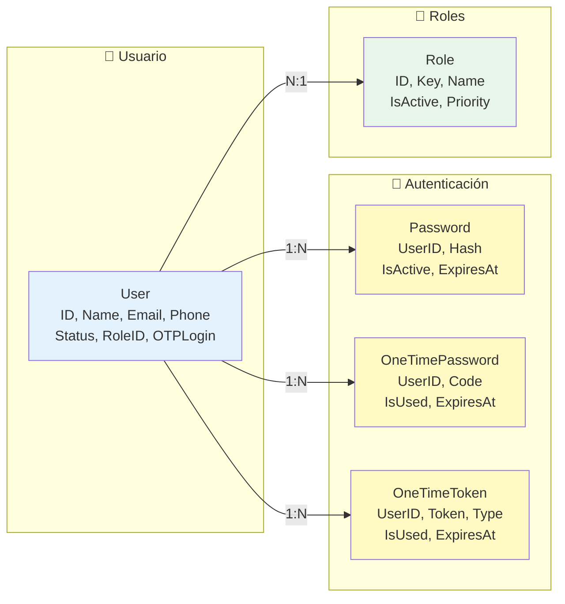

### Migraciones

Las migraciones se ejecutan automáticamente al iniciar la aplicación usando GORM AutoMigrate.

### Cache

El sistema utiliza Redis para cachear consultas frecuentes, especialmente en listados de usuarios.

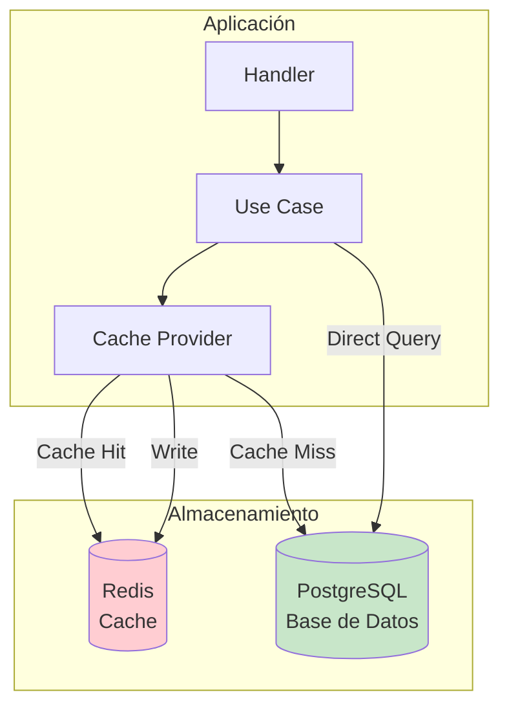

---

## Autenticación y Seguridad

### Diagrama de Flujo de Autenticación

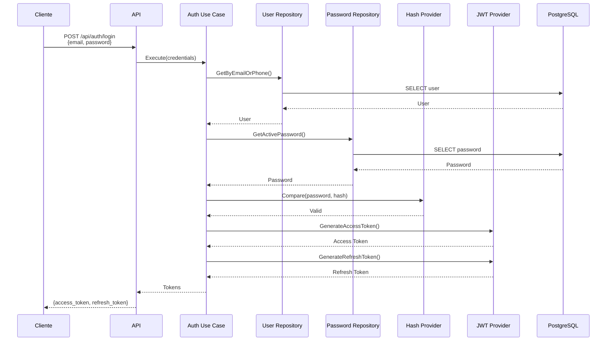

### Flujo de Autenticación con OTP

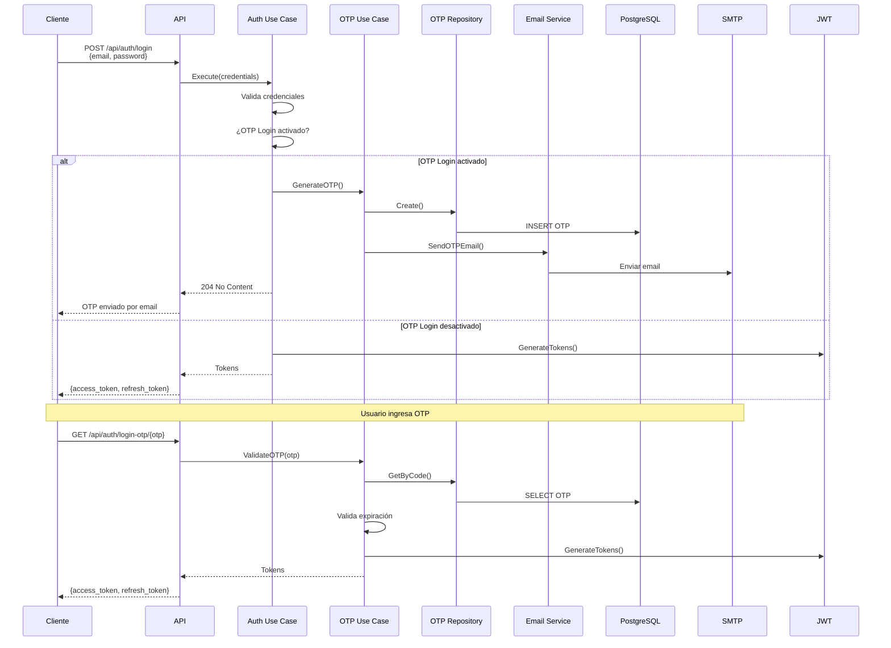

### JWT (JSON Web Tokens)

El sistema utiliza JWT para autenticación con dos tipos de tokens:

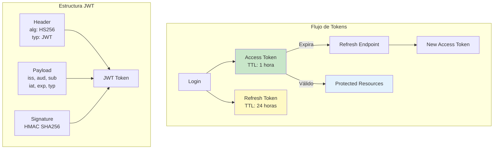

1. **Access Token**: Token de acceso (TTL: 1 hora por defecto)
2. **Refresh Token**: Token de renovación (TTL: 24 horas por defecto)

### OTP (One-Time Password)

Sistema de autenticación de dos factores:

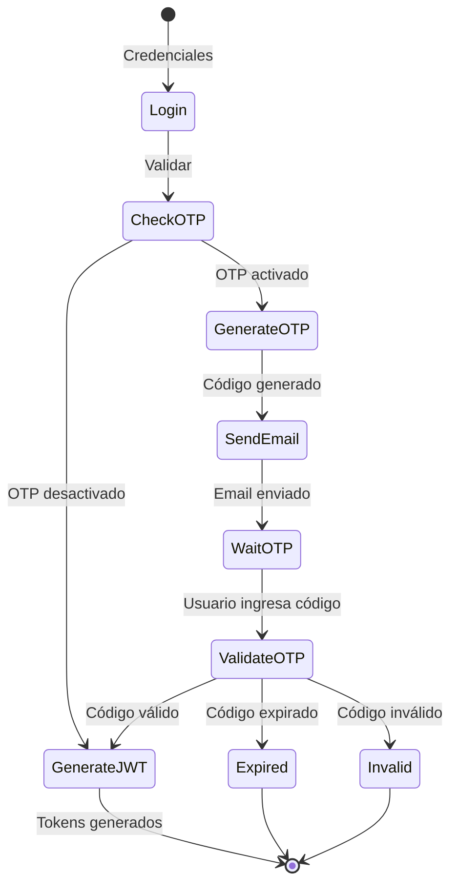

- Generación automática de códigos OTP
- Envío por email
- TTL configurable (por defecto: 10 minutos)

### Seguridad

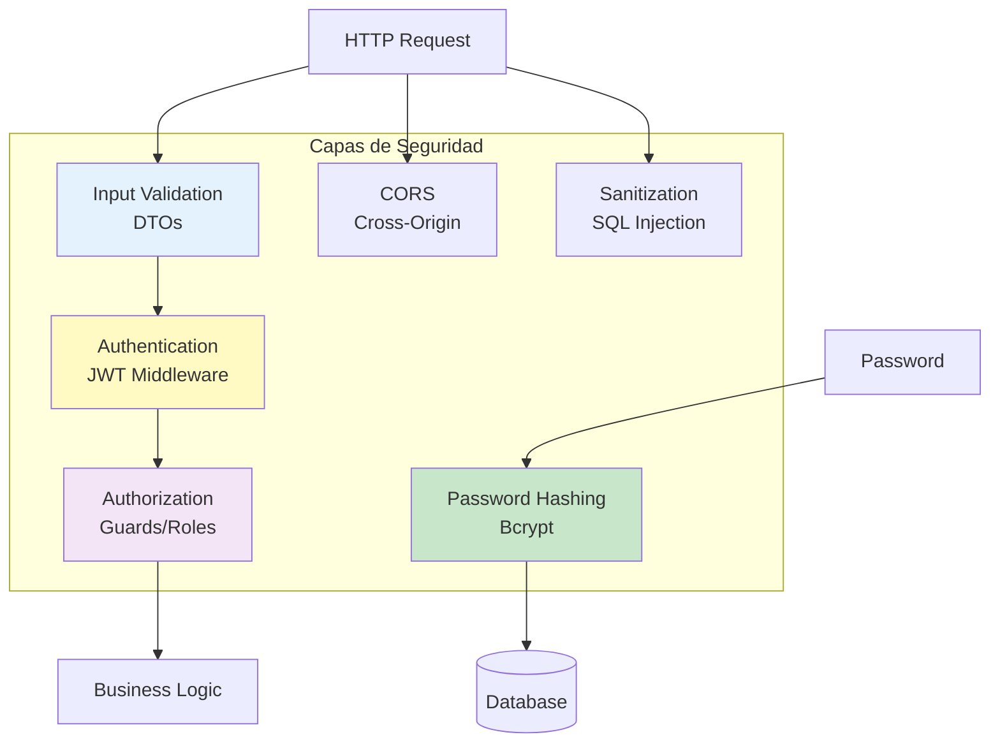

- **Hash de contraseñas**: Bcrypt con salt automático
- **Validación de entrada**: En todos los endpoints
- **Middleware de autenticación**: Para rutas protegidas
- **CORS**: Configurado para seguridad web
- **Sanitización**: Prevención de inyecciones

---

## Testing

### Estructura de Tests

```
tests/
├── e2e/                    # Tests end-to-end
│   ├── collection.json     # Postman collection
│   └── environment.json    # Postman environment
└── integration/            # Tests de integración
    ├── main_test.go        # Setup de tests
    ├── user_repository_test.go
    ├── password_repository_test.go
    └── email_provider_test.go
```

### Tipos de Testing

1. **Unit Tests**: Tests de unidades individuales (en cada módulo)
2. **Integration Tests**: Tests de integración con base de datos
3. **E2E Tests**: Tests end-to-end con Postman

### Ejecutar Tests

```bash
# Tests unitarios
go test ./src/...

# Tests de integración
go test ./tests/integration/...

# Tests E2E (requiere servicios corriendo)
# Usar Postman collection en tests/e2e/
```

---

## Docker y Despliegue

### Arquitectura Docker

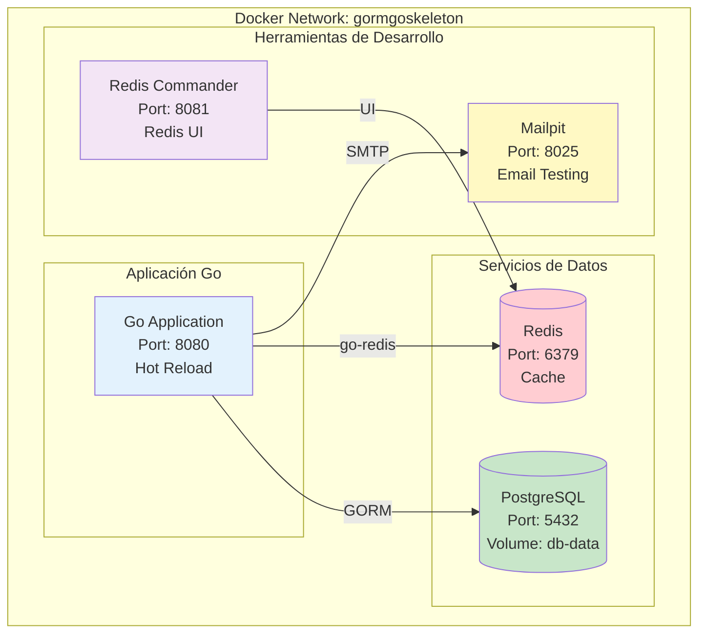

### Diagrama de Despliegue

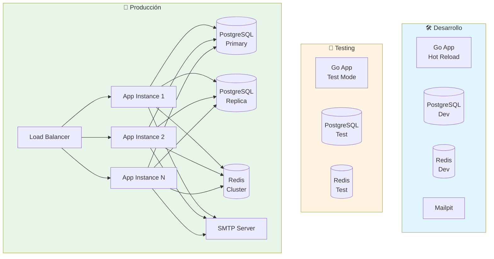

### Servicios Docker

El proyecto incluye configuración Docker para desarrollo:

- **Aplicación**: Servidor Go con hot reload
- **PostgreSQL**: Base de datos principal
- **Redis**: Cache y sesiones
- **Mailpit**: Servidor de email para desarrollo
- **Redis Commander**: Interfaz web para Redis

### Comandos Docker

```bash
# Desarrollo
docker-compose -f docker/docker-compose.dev.yml up -d

# Testing
docker-compose -f docker/docker-compose.test.yml up -d

# E2E Testing
docker-compose -f docker/docker-compose.e2e.yml up -d
```

---

## Guía de Desarrollo

### Agregar Nueva Funcionalidad

#### Diagrama de Flujo para Agregar Funcionalidad

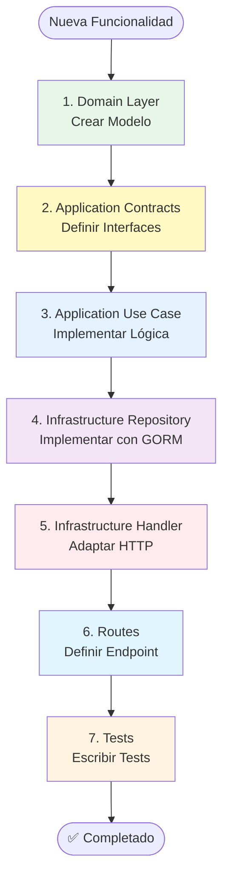

#### Pasos Detallados

1. **Crear modelo en `domain/models/`**
```go
type NewEntity struct {
    // Campos
}
```

2. **Definir interfaz en `application/contracts/repositories/`**
```go
type INewEntityRepository interface {
    Create(input NewEntityCreate) (*NewEntity, error)
    // Más métodos
}
```

3. **Implementar caso de uso en `application/modules/newmodule/use_cases/`**
```go
type CreateNewEntityUseCase struct {
    repo INewEntityRepository
}

func (uc *CreateNewEntityUseCase) Execute(...) *UseCaseResult[NewEntity] {
    // Lógica de negocio
}
```

4. **Crear repositorio en `infrastructure/repositories/`**
```go
type NewEntityRepository struct {
    RepositoryBase[...]
}

func (r *NewEntityRepository) Create(...) (*NewEntity, error) {
    // Implementación con GORM
}
```

5. **Agregar handler en `infrastructure/handlers/`**
```go
func CreateNewEntity(ctx HandlerContext) {
    // Adaptar HTTP a caso de uso
}
```

6. **Definir ruta en `infrastructure/api/routes/router.go`**
```go
r.POST("/new-entity", wrapHandler(handlers.CreateNewEntity))
```

7. **Escribir tests**

### Convenciones de Código

- **Nombres**: camelCase para variables, PascalCase para tipos
- **Comentarios**: Documentar funciones públicas
- **Errores**: Usar el sistema de errores centralizado
- **Logging**: Usar el logger centralizado
- **Validación**: Validar entrada en todos los endpoints

---

## Conclusión

**GoProjectSkeleton** proporciona una base sólida, escalable y mantenible para desarrollar aplicaciones empresariales en Go. La arquitectura Clean Architecture, junto con patrones de diseño avanzados, proporciona una base excelente para el crecimiento del sistema.

### Puntos Fuertes

- ✅ **Arquitectura sólida** y bien estructurada
- ✅ **Escalabilidad** horizontal y vertical
- ✅ **Serverless ready** - Fácil migración a serverless
- ✅ **Testing completo** en múltiples capas
- ✅ **Documentación** exhaustiva
- ✅ **Docker completo** para desarrollo y producción

### Próximos Pasos

1. Revisar la documentación Swagger en `/docs/`
2. Explorar los tests de ejemplo
3. Adaptar a tus necesidades específicas
4. Agregar nuevas funcionalidades siguiendo los patrones establecidos

Para más información, consulta la documentación Swagger en `/docs/` o revisa los tests de ejemplo en la carpeta `tests/`.
