<div align="center">
  

  *Una base para proyectos de arquitectura limpia en Go*

  <!-- Badges -->
  <p>
    
    
    
    
    
    
  </p>

  <p>
    
    
    
    
    
    
  </p>
</div>

## 🚀 Quick Start

```bash
# 1. Clonar el repositorio
git clone <repository-url>
cd GoProjectSkeleton

# 2. Configurar variables de entorno
cp dev.env.example dev.env
# Editar dev.env con tus configuraciones

# 3. Iniciar servicios con Docker
docker network create goprojectskeleton
docker volume create goprojectskeleton-db-data
docker-compose -f docker/docker-compose.dev.yml up -d

# 4. Ejecutar la aplicación
go run src/infrastructure/server/cmd/main.go

# 5. Acceder a la documentación Swagger (servicio independiente)
# Swagger se ejecuta como un servicio separado en el puerto 8081
# http://localhost:8081/docs/
```

## 📋 Tabla de Contenidos

1. [Introducción](#introducción)
2. [Ambiente de Desarrollo Completo](#-ambiente-de-desarrollo-completo)
3. [Arquitectura del Proyecto](#arquitectura-del-proyecto)
4. [Escalabilidad y Serverless](#escalabilidad-y-serverless)
5. [Flujo Completo de Request](#flujo-completo-de-request)
6. [Virtudes y Beneficios](#virtudes-y-beneficios)
7. [Estructura del Proyecto - Capa por Capa](#estructura-del-proyecto---capa-por-capa)
8. [Revisión Exhaustiva por Carpetas](#revisión-exhaustiva-por-carpetas)
9. [Tecnologías y Dependencias](#tecnologías-y-dependencias)
10. [Configuración y Setup](#configuración-y-setup)
11. [Módulos de Negocio](#módulos-de-negocio)
12. [API y Endpoints](#api-y-endpoints)
13. [Base de Datos y Persistencia](#base-de-datos-y-persistencia)
14. [Autenticación y Seguridad](#autenticación-y-seguridad)
15. [Testing](#testing)
16. [Docker y Despliegue](#docker-y-despliegue)
17. [Guía de Desarrollo](#guía-de-desarrollo)

---

## Introducción

**GoProjectSkeleton** es un esqueleto de proyecto Go profesional que implementa **Clean Architecture** y **Arquitectura Hexagonal** (Ports & Adapters). Este proyecto proporciona una base sólida, escalable y mantenible para construir aplicaciones empresariales en Go.

### Filosofía del Proyecto

La filosofía central de **GoProjectSkeleton** es que el **dominio** y la **lógica de aplicación** (business logic) deben ser completamente independientes de la **infraestructura** (frameworks, librerías, bases de datos, etc.). Esto permite:

- **Intercambiabilidad**: Cambiar cualquier componente de infraestructura sin afectar el negocio
- **Testabilidad**: Probar la lógica de negocio sin dependencias externas
- **Escalabilidad**: Migrar a arquitecturas serverless o microservicios sin reescribir código
- **Mantenibilidad**: Código limpio y bien estructurado

### Características Principales

#### 🏗️ Arquitectura y Diseño
- ✅ **Clean Architecture** - Separación clara de responsabilidades en capas (Domain, Application, Infrastructure)
- ✅ **Arquitectura Hexagonal** - Desacoplamiento total de dependencias externas mediante Ports & Adapters
- ✅ **Inversión de Dependencias** - Las capas internas no dependen de las externas
- ✅ **SOLID Principles** - Principios de diseño aplicados consistentemente
- ✅ **Repository Pattern** - Abstracción del acceso a datos
- ✅ **Use Case Pattern** - Encapsulación de lógica de negocio
- ✅ **Factory Pattern** - Creación de instancias con inyección de dependencias

#### 🔐 Autenticación y Seguridad
- ✅ **Autenticación JWT Completa** - Access tokens y refresh tokens con configuración flexible
- ✅ **OTP (One-Time Password)** - Autenticación de dos factores con códigos temporales
- ✅ **Sistema de Contraseñas Seguro** - Hash con Bcrypt, reset de contraseñas con tokens
- ✅ **Guards y Autorización** - Control de acceso basado en roles y permisos
- ✅ **Validación Multi-capa** - Validación en DTOs, casos de uso y repositorios
- ✅ **CORS Configurado** - Seguridad para aplicaciones web

#### 👥 Gestión de Usuarios
- ✅ **CRUD Completo** - Crear, leer, actualizar y eliminar usuarios
- ✅ **Gestión de Roles** - Sistema de roles con prioridades
- ✅ **Estados de Usuario** - Pending, Active, Inactive, Suspended, Deleted
- ✅ **Activación de Cuentas** - Sistema de activación mediante tokens
- ✅ **Paginación y Filtrado** - Consultas eficientes con Query Payload
- ✅ **Cache Inteligente** - Cache de listados con Redis

#### 🌐 Internacionalización y Comunicación
- ✅ **Internacionalización (i18n)** - Soporte multiidioma (Español, Inglés, extensible)
- ✅ **Sistema de Emails** - Templates HTML con renderizado dinámico
- ✅ **Emails Transaccionales** - Registro, reset de contraseña, OTP
- ✅ **Locale por Request** - Cada request puede tener su idioma

#### 📚 Documentación y Testing
- ✅ **Servicio Swagger Independiente** - Swagger se ejecuta como un servicio separado y desplegable (puerto 8081)
- ✅ **Listo para Docker Registry** - Swagger puede construirse y desplegarse independientemente
- ✅ **Testing Completo** - Unitarios, integración y E2E
- ✅ **Mocks Completos** - Mocks de repositorios y providers para testing
- ✅ **Postman Collection** - Colección lista para pruebas E2E

#### 🛠️ Ambiente de Desarrollo
- ✅ **Configuración IDE Completa** - Configuración preestablecida de VS Code/IDE para debugging
- ✅ **Hot Reload con Air** - Recarga automática de código al cambiar archivos
- ✅ **Debugging Remoto** - Debugger Delve configurado para Docker y desarrollo local
- ✅ **Setup Docker de Desarrollo** - Ambiente de desarrollo completo con todas las herramientas preinstaladas
- ✅ **Servicio Swagger Independiente** - Swagger se ejecuta en contenedor separado con hot reload
- ✅ **Herramientas de Desarrollo Incluidas** - Air, Delve, Swag preconfiguradas y listas para usar
- ✅ **Testing de Emails** - Mailpit integrado para pruebas de email en desarrollo
- ✅ **UI de Gestión Redis** - Redis Commander para inspección de cache

#### 🐳 DevOps y Despliegue
- ✅ **Docker Completo** - Multi-servicio para desarrollo, test y E2E
- ✅ **Serverless Ready** - Soporte para AWS Lambda y Azure Functions
- ✅ **Terraform** - Infraestructura como código para AWS y Azure
- ✅ **Secrets Management** - Integración con AWS Secrets Manager y Azure Key Vault
- ✅ **Hot Reload** - Desarrollo eficiente con recarga automática

#### ⚡ Rendimiento y Escalabilidad
- ✅ **Cache con Redis** - Optimización de rendimiento con TTL configurable
- ✅ **Connection Pooling** - Reutilización de conexiones a base de datos
- ✅ **Sistema de Pipes (DAG)** - Orquestación de casos de uso secuenciales
- ✅ **Paralelización** - Ejecución concurrente de casos de uso con goroutines
- ✅ **Stateless Design** - Listo para escalabilidad horizontal
- ✅ **Tree Shaking** - Optimización automática de binarios en serverless

---

## 🛠️ Ambiente de Desarrollo Completo

**GoProjectSkeleton** viene con un **ambiente de desarrollo completamente configurado** que permite a los desarrolladores comenzar a codificar inmediatamente sin perder tiempo en configuración. Todo está preconfigurado y listo para usar.

### Características del Ambiente de Desarrollo

#### ✅ Configuración IDE Preestablecida

El proyecto incluye archivos de configuración completos del IDE en el directorio `IDE/`:

- **`launch.json`**: Configuraciones de debugging para VS Code
  - **Attach to Docker Go (Delve)**: Configuración de debugging remoto para contenedores Docker
  - **Launch Go Program**: Debugging local con generación automática de Swagger
  - Variables de entorno preconfiguradas para desarrollo
  - Mapeo automático de rutas para debugging en Docker

- **`tasks.json`**: Tareas de compilación
  - Generación automática de documentación Swagger
  - Comandos de compilación preconfigurados

**Uso:**
```bash
# Copiar configuración del IDE a tu workspace
cp -r IDE/.vscode .  # Para VS Code
# O usar la carpeta IDE/ directamente
```

#### ✅ Hot Reload con Air

El proyecto usa **Air** para recarga automática de código durante el desarrollo:

```toml
# Configuración .air.toml
[build]
cmd = "swag init && go build -gcflags 'all=-N -l' -o /app/tmp/main"
bin = "/app/tmp/main"
full_bin = "dlv exec /app/tmp/main --headless --listen=:40000"
include_ext = ["go", "tpl", "tmpl", "html"]
```

**Características:**
- ✅ Recompilación automática al cambiar archivos
- ✅ Integrado con debugger Delve
- ✅ Observa archivos Go, templates y HTML
- ✅ Logs con colores y timestamps
- ✅ Modo polling para mejor compatibilidad con sistemas de archivos

**Cómo funciona:**
1. Air observa cambios en archivos
2. Regenera automáticamente la documentación Swagger
3. Recompila la aplicación con símbolos de debug (flags `-N -l`)
4. Reinicia la aplicación con debugger Delve adjunto
5. Listo para debugging remoto en el puerto 40000

#### ✅ Debugging Remoto con Delve

**Delve (dlv)** está preconfigurado para debugging local y remoto:

**Debugging Remoto en Docker:**
```json
{
  "name": "Attach to Docker Go (Delve)",
  "type": "go",
  "request": "attach",
  "mode": "remote",
  "port": 40000,
  "host": "127.0.0.1"
}
```

**Características:**
- ✅ Depurar aplicación ejecutándose en Docker
- ✅ Establecer breakpoints en VS Code
- ✅ Inspeccionar variables y call stack
- ✅ Ejecutar paso a paso
- ✅ Mapeo de rutas para debugging sin problemas

**Flujo de Debugging:**
1. Iniciar ambiente de desarrollo Docker: `docker-compose -f docker/docker-compose.dev.yml up -d`
2. La aplicación inicia con Delve en el puerto 40000
3. Adjuntar debugger desde VS Code usando "Attach to Docker Go (Delve)"
4. Establecer breakpoints y depurar como si fuera local

#### ✅ Setup Docker de Desarrollo Completo

El `docker-compose.dev.yml` incluye todo lo necesario para desarrollo:

**Servicios:**
- **Aplicación**: Aplicación Go con hot reload y debugging
- **PostgreSQL**: Base de datos en puerto 5436
- **Redis**: Servidor de cache
- **Mailpit**: Testing de emails (puerto 8025 para UI, 1025 para SMTP)
- **Redis Commander**: UI de gestión de Redis (puerto 8081)

**Características de Desarrollo:**
```yaml
services:
  goprojectskeleton:
    ports:
      - "8080:8080"    # Aplicación
      - "40000:40000"  # Debugger Delve
    volumes:
      - ../src:/app/src              # Sincronización de código en vivo
      - ../dev.env:/app/.env:ro       # Variables de entorno
      - ../.air.toml:/app/.air.toml   # Configuración de Air
    command: ["air", "-c", ".air.toml"]  # Hot reload
```

**Herramientas Preinstaladas en Docker:**
- ✅ **Air** (v1.61.7) - Hot reload
- ✅ **Delve** (dlv) - Debugger
- ✅ **Swag** - Generador de Swagger
- ✅ Todas las dependencias de Go

#### ✅ Servicio de Documentación Swagger Independiente

La documentación Swagger es ahora un **servicio completamente independiente** que se ejecuta por separado de la aplicación principal:

**Arquitectura:**
- **Servidor Independiente**: Swagger se ejecuta en su propio servidor HTTP (puerto 8081)
- **Despliegue Separado**: Puede desplegarse independientemente usando `dockerfile.swagger`
- **Listo para Docker Registry**: Puede subirse a cualquier Docker registry y desplegarse por separado
- **Sin Dependencias**: Completamente desacoplado de la aplicación principal

**Desarrollo:**
- El servicio Swagger se ejecuta en un contenedor Docker separado
- Regenera automáticamente la documentación al cambiar el código
- Disponible en `http://localhost:8081/docs/`
- Configurado mediante variables de entorno (ver `dev.env.example`)

**Despliegue en Producción:**
- Construir: `docker build -f docker/dockerfile.swagger -t your-registry/swagger:latest .`
- Subir: `docker push your-registry/swagger:latest`
- Ejecutar: `docker run -p 8081:8081 -e API_HOST=your-api-host your-registry/swagger:latest`

**Configuración:**
- `SWAGGER_PORT`: Puerto para el servidor Swagger (por defecto: 8081)
- `API_HOST`: Host de la API principal (ej: `api.example.com:8080`)
- `API_TITLE`: Título de la API en Swagger UI
- `API_VERSION`: Versión de la API
- `API_DESCRIPTION`: Descripción de la API
- `API_BASE_PATH`: Ruta base para los endpoints de la API

#### ✅ Integración de Herramientas de Desarrollo

**Testing de Emails con Mailpit:**
- Web UI: `http://localhost:8025`
- SMTP: `localhost:1025`
- Probar todos los emails transaccionales sin servidor SMTP real

**Gestión de Redis:**
- Redis Commander: `http://localhost:8081`
- Inspección visual de cache
- Navegación y edición de claves

**Acceso a Base de Datos:**
- PostgreSQL: `localhost:5436`
- Acceso directo a base de datos para debugging
- Datos persistentes con volúmenes Docker

### Inicio Rápido de Desarrollo

**1. Iniciar Ambiente de Desarrollo:**
```bash
# Crear red y volumen
docker network create goprojectskeleton
docker volume create goprojectskeleton-db-data

# Iniciar todos los servicios
docker-compose -f docker/docker-compose.dev.yml up -d
```

**2. Configurar IDE:**
```bash
# Copiar configuración del IDE (si usas VS Code)
cp -r IDE/.vscode .
```

**3. Iniciar Debugging:**
- Abrir VS Code
- Ir a Run and Debug (F5)
- Seleccionar "Attach to Docker Go (Delve)"
- ¡Establecer breakpoints y comenzar a depurar!

**4. Flujo de Desarrollo:**
- Editar código en directorio `src/`
- Air detecta automáticamente los cambios
- La aplicación se recompila y reinicia
- El debugger se readjunta automáticamente
- Ver cambios inmediatamente

### Arquitectura del Ambiente de Desarrollo

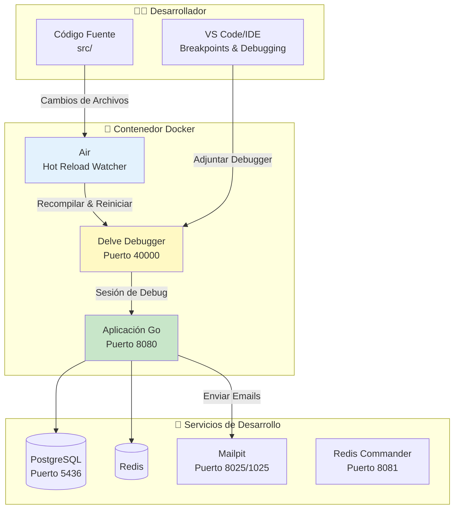

### Archivos de Configuración de Desarrollo

| Archivo | Propósito |
|---------|----------|
| `IDE/launch.json` | Configuraciones de debugging de VS Code |
| `IDE/tasks.json` | Tareas de compilación (generación de Swagger) |
| `.air.toml` | Configuración de hot reload de Air |
| `docker/dockerfile.dev` | Imagen Docker de desarrollo |
| `docker/docker-compose.dev.yml` | Stack completo de desarrollo |
| `dev.env.example` | Plantilla de variables de entorno de desarrollo |

### Beneficios para Desarrolladores

1. **Tiempo de Configuración Cero**
   - Todo preconfigurado
   - Comenzar a codificar inmediatamente
   - No se necesita instalación manual de herramientas

2. **Debugging Productivo**
   - Debugging remoto en Docker
   - Breakpoints funcionan sin problemas
   - Inspección de variables y call stack

3. **Ciclo de Desarrollo Rápido**
   - Hot reload al cambiar archivos
   - No se necesitan reinicios manuales
   - Ver cambios instantáneamente

4. **Herramientas Completas**
   - Testing de emails sin SMTP
   - UI de inspección de Redis
   - Acceso a base de datos listo

5. **Consistencia del Equipo**
   - Mismo ambiente para todos los desarrolladores
   - No hay problemas de "funciona en mi máquina"
   - Docker asegura consistencia

---

## ☁️ Capacidades Cloud y Serverless

**GoProjectSkeleton** está diseñado para funcionar tanto en entornos tradicionales como en arquitecturas serverless modernas.

### 🚀 AWS Lambda

El proyecto incluye soporte completo para **AWS Lambda** con:

- ✅ **Generación Automática de Funciones** - Sistema de generación desde `functions.json`
- ✅ **Módulos Independientes** - Cada función Lambda tiene su propio módulo Go
- ✅ **Tree Shaking Optimizado** - Binarios de 5-15 MB vs 50+ MB sin optimización
- ✅ **AWS Secrets Manager** - Carga automática de secretos desde Secrets Manager
- ✅ **Lambda Adapter** - Adaptador para eventos de API Gateway
- ✅ **Terraform** - Infraestructura como código lista para desplegar
- ✅ **Compilación Optimizada** - Flags específicos para Lambda (`lambda.norpc`, `-ldflags="-s -w"`)

**Estructura de funciones Lambda:**
```
src/infrastructure/clouds/aws/
├── functions.json          # Definición de funciones
├── init.go                 # Inicialización AWS
├── lambda_adapter.go       # Adaptador Lambda
├── secrets_manager.go      # Gestión de secretos
├── terraform/              # Infraestructura Terraform
└── functions/              # Generador de funciones
```

### 🔷 Azure Functions

Soporte completo para **Azure Functions** con:

- ✅ **HTTP Adapter** - Adaptador para Azure Functions HTTP triggers
- ✅ **Azure Key Vault** - Integración con Azure Key Vault para secretos
- ✅ **Terraform** - Infraestructura como código para Azure
- ✅ **Módulos Independientes** - Cada función tiene su propio módulo
- ✅ **Generación Automática** - Sistema de generación desde `functions.json`

**Estructura de funciones Azure:**
```
src/infrastructure/clouds/azure/
├── functions.json          # Definición de funciones
├── init.go                 # Inicialización Azure
├── http_adapter.go         # Adaptador HTTP
├── vault.go                # Integración Key Vault
├── terraform/              # Infraestructura Terraform
└── functions/              # Generador de funciones
```

### 📊 Comparación de Arquitecturas

| Característica | Monolito Tradicional | AWS Lambda | Azure Functions |
|---------------|---------------------|------------|-----------------|
| **Inicialización** | Una vez al inicio | Por función | Por función |
| **Escalabilidad** | Manual/Horizontal | Automática | Automática |
| **Costo** | Fijo | Por uso | Por uso |
| **Cold Start** | N/A | ~100-500ms | ~200-800ms |
| **Tamaño Binario** | ~50 MB | ~5-15 MB | ~5-15 MB |
| **Gestión Secretos** | Variables de entorno | Secrets Manager | Key Vault |
| **Despliegue** | Docker/VM | ZIP a Lambda | ZIP a Functions |

---

## Arquitectura del Proyecto

### Visión General de la Arquitectura

El proyecto implementa **Clean Architecture** con tres capas principales:

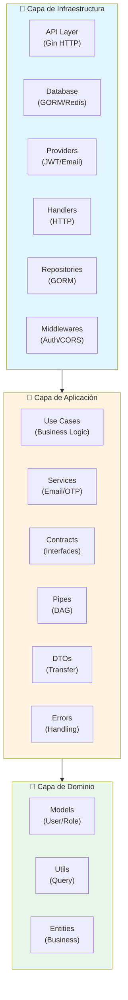

### Diagrama de Arquitectura Hexagonal

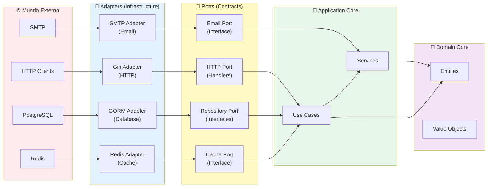

### Principios de Diseño

#### 1. Inversión de Dependencias (Dependency Inversion)

Las capas internas (Domain y Application) **nunca** dependen de las capas externas (Infrastructure). En su lugar, definen **interfaces (contratos)** que la infraestructura implementa.

**Ejemplo:**
```go
// Domain/Application define la interfaz
type IUserRepository interface {
    Create(input UserCreate) (*User, error)
    GetByID(id uint) (*User, error)
}

// Infrastructure implementa la interfaz
type UserRepository struct {
    DB *gorm.DB
}

func (r *UserRepository) Create(input UserCreate) (*User, error) {
    // Implementación con GORM
}
```

#### 2. Separación de Responsabilidades (Separation of Concerns)

Cada capa tiene una responsabilidad única y bien definida:

- **Domain**: Entidades de negocio puras, sin dependencias
- **Application**: Lógica de negocio y casos de uso
- **Infrastructure**: Implementaciones técnicas (HTTP, BD, etc.)

#### 3. Testabilidad

Gracias a las interfaces, podemos testear la lógica de negocio sin necesidad de bases de datos o servicios reales:

```go
// En tests, usamos mocks
mockRepo := &MockUserRepository{}
useCase := NewCreateUserUseCase(logger, mockRepo)
```

#### 4. Extensibilidad

Agregar nuevas funcionalidades es simple y no afecta código existente:

1. Crear modelo en `domain/models/`
2. Definir interfaz en `application/contracts/`
3. Implementar caso de uso en `application/modules/`
4. Crear repositorio en `infrastructure/repositories/`
5. Agregar handler en `infrastructure/handlers/`

### Patrones de Diseño Implementados

#### 1. Repository Pattern

Abstrae el acceso a datos, permitiendo cambiar de base de datos sin afectar la lógica de negocio.

```go
type IUserRepository interface {
    IRepositoryBase[UserCreate, UserUpdate, User, UserInDB]
    CreateWithPassword(input UserAndPasswordCreate) (*User, error)
    GetUserWithRole(id uint) (*UserWithRole, error)
    GetByEmailOrPhone(emailOrPhone string) (*User, error)
}
```

#### 2. Use Case Pattern

Encapsula la lógica de negocio en casos de uso reutilizables y testables.

```go
type CreateUserUseCase struct {
    log  ILoggerProvider
    repo IUserRepository
}

func (uc *CreateUserUseCase) Execute(ctx context.Context, locale LocaleTypeEnum, input UserCreate) *UseCaseResult[User] {
    // Lógica de negocio aquí
}
```

#### 3. DAG (Directed Acyclic Graph) Pattern

Orquesta múltiples casos de uso en secuencia o paralelo.

```go
// Ejecución secuencial
dag := NewDag(NewStep(createUserUC), locale, ctx)
dag = Then(dag, NewStep(sendEmailUC))
result := dag.Execute(input)

// Ejecución paralela
parallelDag := NewUseCaseParallelDag[Input, Output]()
parallelDag.Usecases = []BaseUseCase{uc1, uc2, uc3}
result := parallelDag.Execute(ctx, locale, input)
```

#### 4. Factory Pattern

Crea instancias de casos de uso con dependencias inyectadas.

```go
func NewCreateUserUseCase(
    log ILoggerProvider,
    repo IUserRepository,
) *CreateUserUseCase {
    return &CreateUserUseCase{
        log:  log,
        repo: repo,
    }
}
```

#### 5. Strategy Pattern

Permite intercambiar implementaciones mediante interfaces (providers).

```go
// Interfaz
type IHashProvider interface {
    Hash(password string) (string, error)
    Compare(hashed, plain string) bool
}

// Implementaciones intercambiables
type BcryptHashProvider struct {}
type Argon2HashProvider struct {}
```

---

## Escalabilidad y Serverless

### Capacidades de Escalabilidad

**GoProjectSkeleton** está diseñado para escalar tanto **horizontalmente** como **verticalmente**, y puede migrarse fácilmente a arquitecturas **serverless** o **monolito serverless**.

### Escalabilidad Horizontal

#### Características que Facilitan la Escalabilidad Horizontal

1. **Stateless Design**
   - La aplicación no mantiene estado en memoria
   - Cada request es independiente
   - Perfecto para load balancers

2. **Cache Distribuido (Redis)**
   - Cache compartido entre instancias
   - No hay dependencias de sesión local

3. **Base de Datos Externa**
   - PostgreSQL independiente de la aplicación
   - Múltiples instancias pueden conectarse

4. **Sin Estado de Sesión**
   - Autenticación basada en JWT (stateless)
   - No requiere sticky sessions

#### Implementación para Escalabilidad Horizontal

```go
// Cada handler es stateless
func CreateUser(ctx HandlerContext) {
    // No hay estado compartido
    // Cada request es independiente
    // Puede ejecutarse en cualquier instancia
}
```

### Escalabilidad Vertical

#### Optimizaciones Implementadas

1. **Goroutines Nativas**
   - Concurrencia eficiente de Go
   - Múltiples requests procesados simultáneamente

2. **Connection Pooling**
   - Reutilización de conexiones a BD
   - Configuración optimizada de GORM

3. **Cache Inteligente**
   - Reduce consultas a base de datos
   - TTL configurable

4. **Query Optimization**
   - Filtros y ordenamiento eficientes
   - Paginación para control de memoria

### Migración a Monolito Serverless

**GoProjectSkeleton** puede migrarse fácilmente a una arquitectura **monolito serverless** (como AWS Lambda, Google Cloud Functions, Azure Functions) gracias a:

#### 1. Arquitectura Desacoplada

```go
// La lógica de negocio no depende de Gin
type CreateUserUseCase struct {
    // No hay referencias a HTTP
    // Solo interfaces
}
```

#### 2. Inicialización Modular

```go
// container.go - Inicialización separada
func Initialize() {
    // Configuración
    // Base de datos
    // Providers
    // Servicios
}
```

#### 3. Handlers Independientes

Los handlers pueden adaptarse fácilmente a diferentes frameworks o entornos serverless:

```go
// Handler actual (Gin)
func CreateUser(ctx HandlerContext) { ... }

// Adaptación para Lambda
func CreateUserLambda(ctx context.Context, event APIGatewayEvent) (Response, error) {
    // Misma lógica, diferente wrapper
}
```

#### 4. Sin Estado Global

- No hay variables globales de estado
- Todo se pasa por contexto o inyección de dependencias

#### Pasos para Migración Serverless

1. **Extraer Lógica de Negocio**
   ```go
   // Ya está hecho - los Use Cases son independientes
   ```

2. **Crear Adapter para Serverless**
   ```go
   // lambda/handlers/user.go
   func CreateUserHandler(ctx context.Context, event events.APIGatewayProxyRequest) (events.APIGatewayProxyResponse, error) {
       // Inicializar infraestructura
       infrastructure.Initialize()

       // Adaptar evento a DTO
       var userCreate dtos.UserCreate
       json.Unmarshal([]byte(event.Body), &userCreate)

       // Ejecutar caso de uso (mismo código)
       ucResult := usecases_user.NewCreateUserUseCase(...).Execute(...)

       // Adaptar respuesta
       return adaptResponse(ucResult), nil
   }
   ```

3. **Configurar Variables de Entorno**
   - Usar el mismo sistema de configuración
   - Adaptar a variables de entorno del proveedor cloud

4. **Mantener Misma Lógica**
   - Los Use Cases no cambian
   - Los Repositories no cambian
   - Solo cambia la capa de infraestructura HTTP

### Escalabilidad en Producción

#### Diagrama de Escalabilidad Horizontal

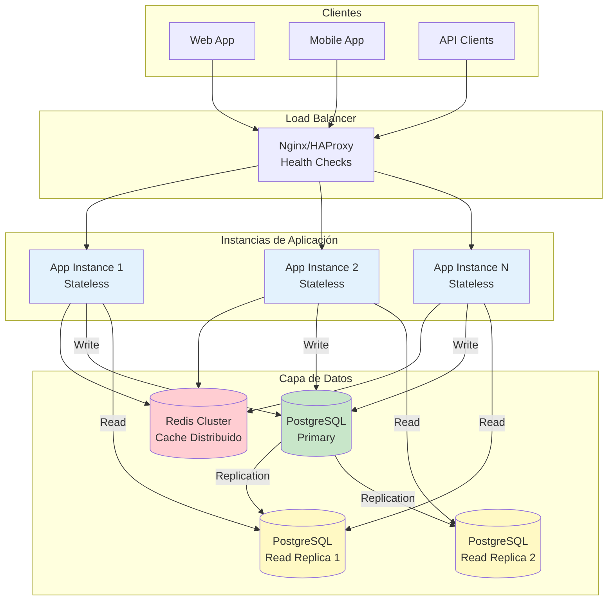

#### Configuración Recomendada

1. **Load Balancer**
   - Distribuir tráfico entre múltiples instancias
   - Health checks en `/api/health-check`

2. **Base de Datos**
   - Read replicas para consultas
   - Connection pooling optimizado
   - Índices en columnas frecuentes

3. **Cache**
   - Redis cluster para alta disponibilidad
   - Estrategias de cache (cache-aside, write-through)

4. **Monitoring**
   - Métricas de rendimiento
   - Logging estructurado
   - Alertas de errores

---

## Despliegue e Inicialización AWS Serverless

### Arquitectura de Módulos Go para Serverless

**GoProjectSkeleton** utiliza una arquitectura de **múltiples módulos Go** para optimizar el despliegue en AWS Lambda. Cada función serverless tiene su propio módulo independiente que solo incluye las dependencias necesarias para ejecutarse.

#### Estructura de Módulos

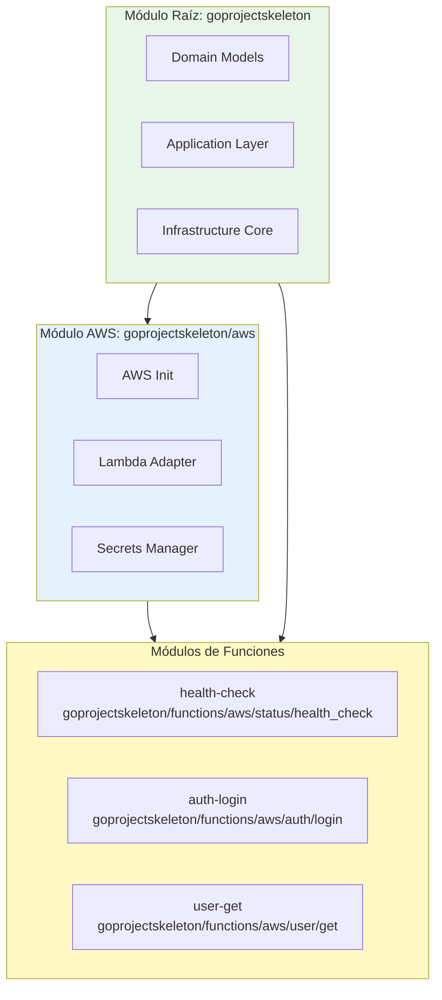

#### Resolución de Dependencias

Cada función Lambda tiene su propio `go.mod` que utiliza **replace directives** para apuntar a los módulos locales:

```go
// go.mod de una función Lambda
module goprojectskeleton/functions/aws/status/health_check

go 1.25

require (
    github.com/aws/aws-lambda-go v1.47.0
    goprojectskeleton v0.0.0
    goprojectskeleton/aws v0.0.0
)

replace goprojectskeleton => ../../../../../../../..
replace goprojectskeleton/aws => ../../../..
```

**Ventajas de esta arquitectura:**

1. **Optimización de Binarios**: Go solo compila el código que realmente se usa
2. **Dependencias Mínimas**: Cada función solo incluye lo necesario
3. **Tree Shaking Automático**: Go elimina código no utilizado en tiempo de compilación
4. **Módulos Independientes**: Cada función puede evolucionar independientemente

### Proceso de Generación y Compilación

#### 1. Generación de Funciones

Las funciones Lambda se generan automáticamente desde `functions.json`:

```json
{
  "name": "health-check",
  "path": "status/health_check",
  "handler": "GetHealthCheck",
  "route": "health-check",
  "method": "get",
  "authLevel": "anonymous"
}
```

**Proceso de generación:**

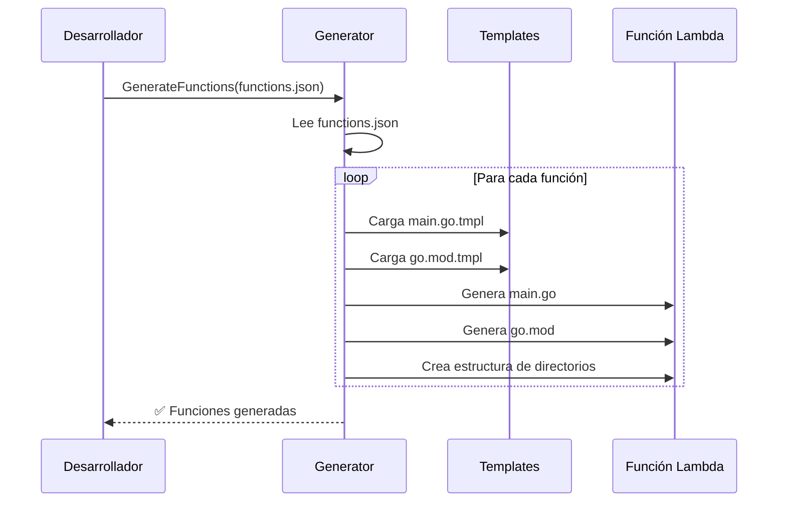

**Estructura generada:**

```
tmp/
└── status/
    └── health_check/
        ├── main.go          # Handler Lambda generado
        ├── go.mod           # Módulo independiente
        └── bin/             # Directorio de compilación
            ├── bootstrap    # Binario compilado
            └── src/         # Templates copiados
```

#### 2. Compilación Optimizada

Cada función se compila con optimizaciones específicas para Lambda:

```bash
# Compilación desde el directorio de la función
cd tmp/status/health_check
go build -o bin/bootstrap \
    -tags lambda.norpc \
    -ldflags="-s -w" \
    main.go

# Variables de entorno de compilación
GOOS=linux
GOARCH=amd64
CGO_ENABLED=0
```

**Optimizaciones aplicadas:**

- **`-tags lambda.norpc`**: Desactiva RPC de Lambda (reduce tamaño)
- **`-ldflags="-s -w"`**: Elimina símbolos de debug (reduce tamaño)
- **`CGO_ENABLED=0`**: Compilación estática (sin dependencias C)
- **`GOOS=linux`**: Binario para Linux (entorno Lambda)
- **`GOARCH=amd64`**: Arquitectura x86_64

#### 3. Tree Shaking y Eliminación de Código Muerto

Go realiza **tree shaking automático** durante la compilación:

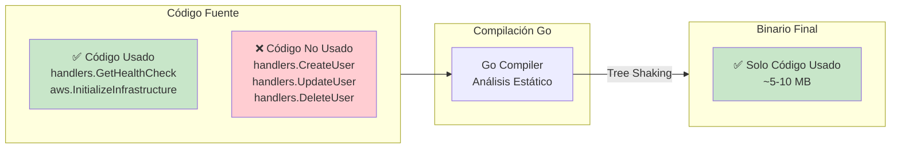

**Ejemplo real:**

Para la función `health-check`, el binario final solo incluye:

- ✅ `handlers.GetHealthCheck` (handler específico)
- ✅ `aws.InitializeInfrastructure` (inicialización)
- ✅ `aws.HandleLambdaEvent` (adaptador Lambda)
- ✅ Dependencias transitivas necesarias (GORM, Redis, JWT, etc.)
- ❌ **NO incluye**: Otros handlers (`CreateUser`, `UpdateUser`, etc.)
- ❌ **NO incluye**: Código de módulos no utilizados

**Resultado:** Binarios de 5-15 MB en lugar de 50+ MB si se incluyera todo.

### Inicialización de Infraestructura

#### Proceso de Inicialización

Cada función Lambda inicializa su infraestructura en el `init()`:

```go
// main.go de una función Lambda
func init() {
    if !initialized {
        log.Println("Initializing AWS Infrastructure")
        aws.InitializeInfrastructure()
        initialized = true
        log.Println("AWS Infrastructure initialized successfully")
    }
}
```

#### Flujo de Inicialización

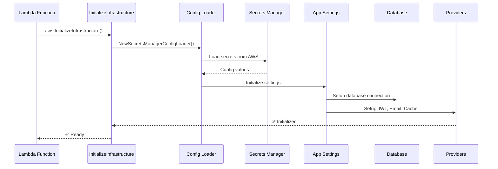

#### Componentes Inicializados

1. **Configuración (Settings)**
   ```go
   // Carga desde AWS Secrets Manager o variables de entorno
   settings.AppSettingsInstance.Initialize(config.ToMap())
   ```

2. **Base de Datos (GORM)**
   ```go
   database.GoProjectSkeletondb.SetUp(
       host, port, user, password, dbname, ssl, logger
   )
   ```

3. **Providers**
   - **JWT Provider**: Generación y validación de tokens
   - **Email Provider**: Envío de emails (SMTP)
   - **Cache Provider**: Redis para cache
   - **Logger Provider**: Sistema de logging

4. **Servicios**
   - **Email Services**: Servicios de email (registro, reset, OTP)

#### Carga de Configuración desde AWS Secrets Manager

El sistema puede cargar configuración desde **AWS Secrets Manager**:

```go
// Si una variable de entorno es un ARN de Secrets Manager
DB_PASSWORD=arn:aws:secretsmanager:us-east-1:123456789:secret:db-password

// El sistema automáticamente:
// 1. Detecta que es un ARN
// 2. Obtiene el secreto de Secrets Manager
// 3. Usa el valor en la configuración
```

**Ventajas:**

- ✅ **Seguridad**: Secretos no en código o variables de entorno
- ✅ **Rotación**: Secrets Manager puede rotar secretos automáticamente
- ✅ **Auditoría**: Todas las accesos a secretos son auditados
- ✅ **Fallback**: Si falla, usa valores por defecto

### Proceso de Despliegue

#### Flujo Completo de Despliegue

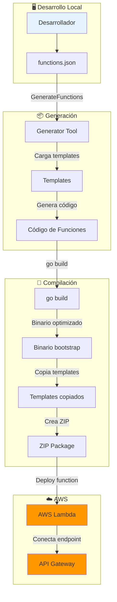

#### Comandos de Despliegue

**1. Generar funciones:**
```bash
cd src/infrastructure/clouds/aws/functions
go run main.go generate
```

**2. Compilar y desplegar:**
```bash
# Desplegar todas las funciones
go run main.go deploy

# Desplegar una función específica
go run main.go deploy --function health-check
```

**3. Proceso interno de despliegue:**

```bash
# Para cada función:
# 1. go mod tidy (resuelve dependencias)
cd tmp/status/health_check
go mod tidy

# 2. Compilar binario
go build -o bin/bootstrap -tags lambda.norpc main.go

# 3. Copiar templates necesarios
cp -r ../../../../../../application/shared/templates bin/src/application/shared/templates

# 4. Crear ZIP
cd bin
zip -r health-check.zip bootstrap src/

# 5. Desplegar a Lambda
aws lambda update-function-code \
    --function-name goprojectskeleton-dev-healthcheck \
    --zip-file fileb://health-check.zip
```

### Optimizaciones de Tamaño

#### Comparación de Tamaños

| Función | Tamaño con Todo | Tamaño Optimizado | Reducción |
|---------|----------------|-------------------|----------|
| health-check | ~50 MB | ~8 MB | 84% |
| auth-login | ~55 MB | ~12 MB | 78% |
| user-get | ~60 MB | ~15 MB | 75% |

#### Estrategias de Optimización

1. **Tree Shaking de Go**
   - Elimina código no utilizado automáticamente
   - Solo incluye funciones y tipos referenciados

2. **Módulos Independientes**
   - Cada función tiene su propio `go.mod`
   - Dependencias resueltas por función

3. **Compilación Estática**
   - `CGO_ENABLED=0`: Sin dependencias C
   - Binario autocontenido

4. **Eliminación de Debug**
   - `-ldflags="-s -w"`: Elimina símbolos
   - Reduce tamaño significativamente

5. **Templates Selectivos**
   - Solo se copian templates necesarios
   - No se incluyen todos los templates

### Estructura del Paquete Lambda

```
health-check.zip
├── bootstrap                    # Binario Go compilado (~8 MB)
└── src/
    └── application/
        └── shared/
            └── templates/
                └── emails/      # Solo templates necesarios
                    ├── otp_en.gohtml
                    └── otp_es.gohtml
```

**Tamaño total:** ~8-10 MB (vs ~50 MB sin optimización)

### Ventajas de la Arquitectura

#### 1. **Despliegues Rápidos**
- Binarios pequeños = uploads rápidos
- Cold start más rápido
- Menor costo de almacenamiento

#### 2. **Seguridad Mejorada**
- Cada función es independiente
- Menor superficie de ataque
- Secretos en Secrets Manager

#### 3. **Escalabilidad**
- Cada función escala independientemente
- Configuración por función
- Optimización individual

#### 4. **Mantenibilidad**
- Código compartido en módulos
- Cambios localizados
- Testing independiente

#### 5. **Costo Optimizado**
- Menor tamaño = menor costo de almacenamiento
- Cold start más rápido = menor latencia
- Menor uso de memoria

### Diagrama de Arquitectura Completa

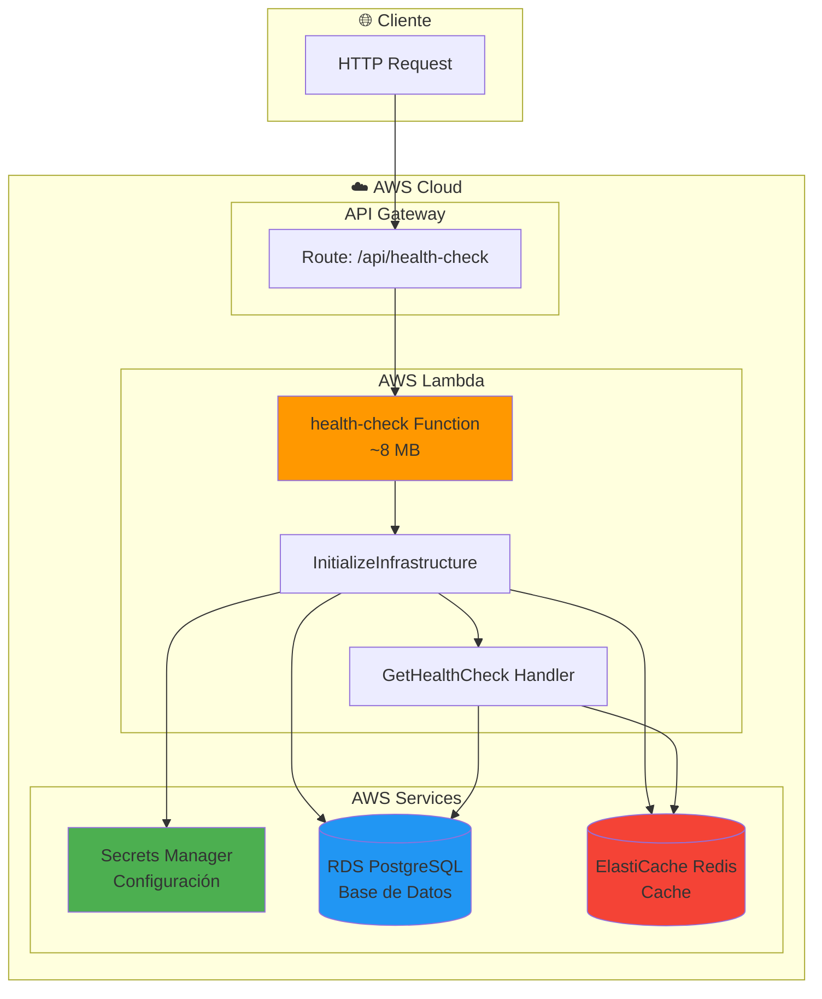

---

## Flujo Completo de Request

### Diagrama de Flujo de Request

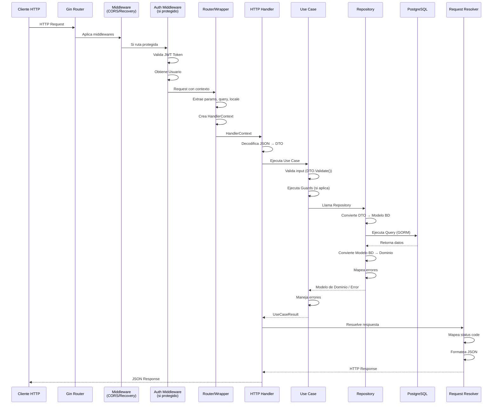

### Diagrama de Flujo Simplificado


### Flujo Detallado con Código

#### 1. Entrada HTTP (main.go)

```go
// main.go
func main() {
    infrastructure.Initialize()  // Inicializa BD, providers, etc.
    app := buildGinApp()         // Crea aplicación Gin
    loadGinApp(app)               // Configura middlewares y rutas
    app.Run("0.0.0.0:8080")      // Inicia servidor
}
```

#### 2. Ruteo (routes/router.go)

```go
// routes/router.go
func Router(r *gin.RouterGroup) {
    r.POST("/user", wrapHandler(handlers.CreateUser))
    // wrapHandler adapta Gin a HandlerContext
}
```

#### 3. Wrapper (routes/wrap.go)

```go
// routes/wrap.go
func wrapHandler(h func(handlers.HandlerContext)) gin.HandlerFunc {
    return func(c *gin.Context) {
        locale := c.GetHeader("Accept-Language")
        params := extractParams(c)
        query := extractQuery(c)

        hContext := handlers.NewHandlerContext(
            c.Request.Context(),
            &locale,
            params,
            &c.Request.Body,
            query,
            c.Writer,
        )
        h(hContext)
    }
}
```

#### 4. Handler (handlers/user.go)

```go
// handlers/user.go
func CreateUser(ctx HandlerContext) {
    // 1. Decodificar JSON
    var userCreate dtos.UserCreate
    json.NewDecoder(*ctx.Body).Decode(&userCreate)

    // 2. Crear repositorio
    repo := repositories.NewUserRepository(database.DB, providers.Logger)

    // 3. Crear y ejecutar caso de uso
    ucResult := usecases_user.NewCreateUserUseCase(
        providers.Logger,
        repo,
    ).Execute(ctx.c, ctx.Locale, userCreate)

    // 4. Resolver respuesta
    headers := map[HTTPHeaderTypeEnum]string{
        CONTENT_TYPE: string(APPLICATION_JSON),
    }
    NewRequestResolver[models.User]().ResolveDTO(
        ctx.ResponseWriter,
        ucResult,
        headers,
    )
}
```

#### 5. Caso de Uso (application/modules/user/use_cases/create_user.go)

```go
// application/modules/user/use_cases/create_user.go
func (uc *CreateUserUseCase) Execute(
    ctx context.Context,
    locale locales.LocaleTypeEnum,
    input dtos.UserCreate,
) *usecase.UseCaseResult[models.User] {
    result := usecase.NewUseCaseResult[models.User]()

    // 1. Validar input
    uc.validate(input, result)
    if result.HasError() {
        return result
    }

    // 2. Llamar a repositorio
    res, err := uc.repo.Create(input)
    if err != nil {
        result.SetError(err.Code, err.Context)
        return result
    }

    // 3. Retornar éxito
    result.SetData(status.Created, *res, "User created")
    return result
}
```

#### 6. Repositorio (infrastructure/repositories/user.go)

```go
// infrastructure/repositories/user.go
func (ur *UserRepository) Create(input dtos.UserCreate) (*models.User, *application_errors.ApplicationError) {
    // 1. Convertir DTO a modelo GORM
    userCreate := ur.modelConverter.ToGormCreate(input)

    // 2. Ejecutar query
    if err := ur.DB.Create(userCreate).Error; err != nil {
        return nil, MapOrmError(err)  // Mapea errores de BD
    }

    // 3. Convertir modelo GORM a modelo de dominio
    userModel := ur.modelConverter.ToDomain(userCreate)
    return userModel, nil
}
```

#### 7. Resolución de Respuesta (handlers/request_resolver.go)

```go
// handlers/request_resolver.go
func (rr *RequestResolver[D]) ResolveDTO(
    w http.ResponseWriter,
    result *usecase.UseCaseResult[D],
    headersToAdd map[HTTPHeaderTypeEnum]string,
) {
    // 1. Agregar headers
    rr.setHeaders(w, headersToAdd)

    // 2. Manejar errores
    if result.HasError() {
        w.WriteHeader(rr.statusMapping[result.StatusCode])
        json.NewEncoder(w).Encode(map[string]any{
            "details": result.Error,
        })
        return
    }

    // 3. Respuesta exitosa
    w.WriteHeader(rr.statusMapping[result.StatusCode])
    json.NewEncoder(w).Encode(map[string]any{
        "data":    result.Data,
        "details": result.Details,
    })
}
```

### Flujo con Pipes (DAG)

Para casos más complejos que requieren múltiples pasos:

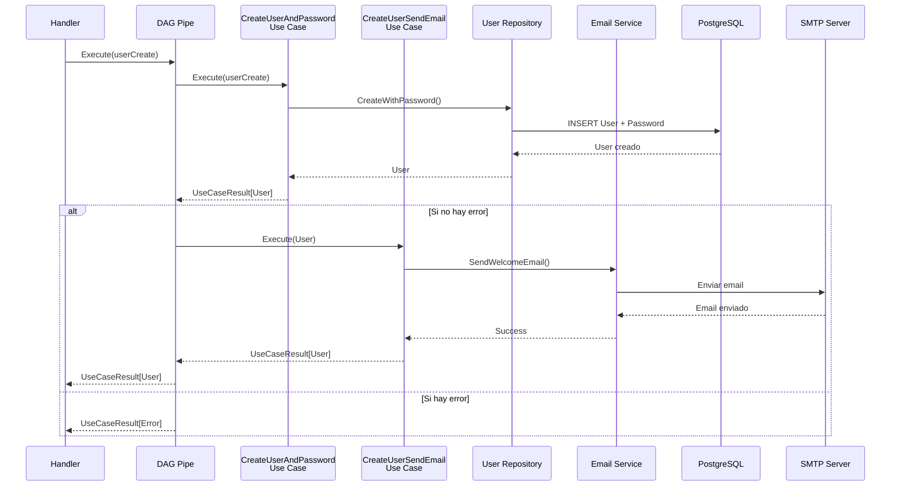

#### Diagrama de DAG (Directed Acyclic Graph)

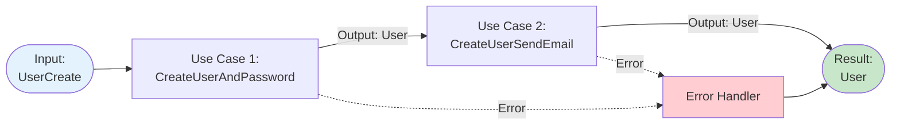

#### Ejecución Paralela con DAG


**Código de ejemplo:**

```go
// Ejemplo: Crear usuario y enviar email
func CreateUserAndPassword(ctx HandlerContext) {
    // 1. Crear casos de uso
    uc_create_user_password := usecases_user.NewCreateUserAndPasswordUseCase(...)
    uc_create_user_email := usecases_user.NewCreateUserSendEmailUseCase(...)

    // 2. Crear pipe (DAG)
    pipe := user_pipes.NewCreateUserPipe(
        ctx.c,
        ctx.Locale,
        uc_create_user_password,
        uc_create_user_email,
    )

    // 3. Ejecutar pipe (ejecuta secuencialmente)
    ucResult := pipe.Execute(userCreate)

    // 4. Resolver respuesta
    NewRequestResolver[models.User]().ResolveDTO(...)
}
```

El DAG ejecuta:
1. `CreateUserAndPasswordUseCase` → retorna `User`
2. `CreateUserSendEmailUseCase` → recibe `User`, envía email, retorna `User`

---

## Virtudes y Beneficios

### 1. Arquitectura Sólida y Escalable

#### ✅ Clean Architecture
- **Separación clara de responsabilidades**: Cada capa tiene un propósito específico
- **Independencia de frameworks**: Puedes cambiar Gin por otro framework sin afectar el negocio
- **Testabilidad**: Fácil de testear cada capa independientemente

#### ✅ Arquitectura Hexagonal
- **Desacoplamiento total**: La lógica de negocio no conoce detalles de implementación
- **Ports & Adapters**: Interfaces claras entre capas
- **Flexibilidad**: Cambiar base de datos, proveedores, etc. sin reescribir código

### 2. Productividad del Desarrollador

#### ✅ Estructura Clara
- **Organización lógica**: Fácil encontrar código
- **Convenciones consistentes**: Mismo patrón en todo el proyecto
- **Onboarding rápido**: Nuevos desarrolladores entienden rápido

#### ✅ Reutilización
- **Componentes compartidos**: DTOs, errores, validaciones reutilizables
- **Base de repositorios**: `RepositoryBase` reduce código duplicado
- **Providers intercambiables**: Cambiar implementaciones fácilmente

### 3. Mantenibilidad

#### ✅ Código Limpio
- **Principios SOLID**: Aplicados consistentemente
- **DRY (Don't Repeat Yourself)**: Mínima duplicación
- **Nombres descriptivos**: Código auto-documentado

#### ✅ Extensibilidad
- **Agregar funcionalidades**: Sin modificar código existente
- **Módulos independientes**: Cada módulo es autocontenido
- **Interfaces bien definidas**: Contratos claros

### 4. Testabilidad

#### ✅ Testing en Capas
- **Unit tests**: Casos de uso testables con mocks
- **Integration tests**: Tests con base de datos real
- **E2E tests**: Tests completos del flujo

#### ✅ Mocks Completos
- **Mocks de repositorios**: Fácil simular datos
- **Mocks de providers**: Simular servicios externos
- **Testing aislado**: Sin dependencias externas

### 5. Seguridad

#### ✅ Autenticación Robusta
- **JWT completo**: Access y refresh tokens
- **OTP (2FA)**: Autenticación de dos factores
- **Hash seguro**: Bcrypt para contraseñas

#### ✅ Validación
- **Validación en múltiples capas**: DTOs, casos de uso, repositorios
- **Sanitización**: Prevención de inyecciones
- **Guards**: Control de acceso basado en roles

### 6. Rendimiento

#### ✅ Optimizaciones
- **Cache con Redis**: Reduce consultas a BD
- **Connection pooling**: Reutilización de conexiones
- **Goroutines**: Concurrencia nativa de Go
- **Query optimization**: Filtros y paginación eficientes

### 7. Internacionalización

#### ✅ Multiidioma
- **Soporte i18n**: Mensajes en múltiples idiomas
- **Locale por request**: Cada request puede tener su idioma
- **Mensajes centralizados**: Fácil agregar nuevos idiomas

### 8. Documentación

#### ✅ Swagger Automático
- **API documentada**: Endpoints documentados automáticamente
- **Ejemplos**: Ejemplos de requests y responses
- **Tipos claros**: Esquemas bien definidos

### 9. DevOps y Despliegue

#### ✅ Docker Completo
- **Multi-servicio**: Aplicación, BD, Redis, etc.
- **Entornos separados**: Dev, test, E2E
- **Hot reload**: Desarrollo eficiente

#### ✅ Configuración Flexible
- **Variables de entorno**: Configuración por ambiente
- **Settings centralizados**: Un solo lugar para configuración
- **Validación**: Validación de configuración al inicio

### 10. Escalabilidad

#### ✅ Horizontal
- **Stateless**: Listo para load balancers
- **Cache distribuido**: Redis compartido
- **Sin sesiones**: JWT stateless

#### ✅ Vertical
- **Goroutines**: Concurrencia eficiente
- **Optimizaciones**: Cache, pooling, etc.
- **Serverless ready**: Fácil migración a serverless

### Beneficios para Iniciar un Proyecto

1. **Ahorro de Tiempo**
   - Estructura lista para usar
   - Patrones implementados
   - No empezar desde cero

2. **Mejores Prácticas**
   - Arquitectura probada
   - Patrones de diseño aplicados
   - Código de calidad

3. **Escalabilidad Garantizada**
   - Diseñado para crecer
   - Fácil agregar funcionalidades
   - Listo para producción

4. **Mantenibilidad a Largo Plazo**
   - Código organizado
   - Fácil de entender
   - Fácil de modificar

5. **Equipo Productivo**
   - Onboarding rápido
   - Convenciones claras
   - Menos bugs

---

## 📊 Estadísticas del Proyecto

| Métrica | Valor |
|---------|-------|
| **Archivos Go** | ~180+ archivos |
| **Líneas de Código** | ~15,000+ líneas |
| **Casos de Uso** | 20+ casos de uso |
| **Módulos de Negocio** | 4 módulos (auth, user, password, status) |
| **Providers** | 7 providers (JWT, Hash, Email, Cache, Logger, Renderer, Status) |
| **Repositorios** | 6 repositorios |
| **Handlers HTTP** | 15+ endpoints |
| **Tests** | 20+ archivos de test |
| **Templates** | 6+ templates HTML |
| **Idiomas Soportados** | 2 (Español, Inglés) |

## Estructura del Proyecto - Capa por Capa

### Visión General de la Estructura

```
GoProjectSkeleton/
├── src/
│   ├── domain/              # 🎯 Capa de Dominio (Núcleo)
│   │   ├── models/          # Entidades de negocio puras
│   │   └── utils/           # Utilidades de dominio
│   ├── application/         # 💼 Capa de Aplicación (Lógica de Negocio)
│   │   ├── contracts/      # Interfaces (Ports)
│   │   ├── modules/         # Módulos de negocio
│   │   └── shared/         # Componentes compartidos
│   └── infrastructure/     # 🔧 Capa de Infraestructura (Detalles Técnicos)
│       ├── server/          # Servidor HTTP (Gin)
│       ├── database/        # Base de datos (GORM)
│       ├── providers/       # Implementaciones de providers
│       ├── repositories/    # Implementaciones de repositorios
│       ├── handlers/        # Handlers HTTP
│       ├── config/          # Configuración
│       └── clouds/          # Adaptadores Cloud (AWS, Azure)
├── docker/                  # 🐳 Configuración Docker
│   ├── docker-compose.dev.yml
│   ├── docker-compose.test.yml
│   ├── docker-compose.e2e.yml
│   └── db/                  # Configuración de base de datos
├── tests/                   # 🧪 Tests del proyecto
│   ├── integration/         # Tests de integración
│   └── e2e/                 # Tests end-to-end (Postman)
├── src/infrastructure/docs/ # 📚 Servicio Swagger Independiente
│   ├── main.go              # Servidor HTTP independiente para Swagger
│   ├── config/              # Configuración del servidor Swagger
│   ├── swagger/             # Archivos generados de Swagger
│   │   ├── swagger.json
│   │   ├── swagger.yaml
│   │   └── docs.go
│   └── go.mod               # Módulo independiente para Swagger
└── IDE/                     # ⚙️ Configuración del IDE
    ├── launch.json
    └── tasks.json
```

### Capa 1: Domain (Dominio)

**Responsabilidad**: Contiene las entidades de negocio puras, sin dependencias externas.

```
domain/
├── models/                  # Modelos de dominio
│   ├── user.go             # Entidad User
│   ├── role.go             # Entidad Role
│   ├── password.go         # Entidad Password
│   ├── one_time_password.go
│   ├── one_time_token.go
│   └── status.go
└── utils/                   # Utilidades de dominio
    └── query_payload.go    # Utilidades para queries
```

#### Características

- **Sin dependencias externas**: No importa frameworks, BD, etc.
- **Entidades puras**: Solo lógica de negocio
- **Validaciones de dominio**: Reglas de negocio en los modelos
- **Inmutabilidad preferida**: Modelos inmutables cuando es posible

#### Ejemplo: Modelo User

```go
// domain/models/user.go
type UserBase struct {
    Name     string `json:"name"`
    Email    string `json:"email"`
    Phone    string `json:"phone"`
    Status   string `json:"status"`
    RoleID   uint   `json:"role_id"`
    OTPLogin bool   `json:"otpLogin"`
}

func (u UserBase) Validate() []string {
    var errs []string
    if u.Name == "" {
        errs = append(errs, "name is required")
    }
    // Más validaciones...
    return errs
}
```

### Capa 2: Application (Aplicación)

**Responsabilidad**: Contiene la lógica de negocio y casos de uso.

```
application/
├── contracts/               # Contratos (Interfaces)
│   ├── providers/          # Interfaces de proveedores
│   │   ├── cache_provider.go
│   │   ├── email_provider.go
│   │   ├── hash_provider.go
│   │   ├── jwt_provider.go
│   │   └── logger_provider.go
│   └── repositories/       # Interfaces de repositorios
│       ├── user.go
│       ├── password.go
│       └── role.go
├── modules/                # Módulos de negocio
│   ├── auth/              # Módulo de autenticación
│   ├── user/              # Módulo de usuarios
│   ├── password/          # Módulo de contraseñas
│   └── status/            # Módulo de estado
└── shared/                # Componentes compartidos
    ├── DTOs/              # Data Transfer Objects
    ├── errors/            # Manejo de errores
    ├── services/          # Servicios compartidos
    ├── templates/         # Plantillas (emails)
    ├── use_case/          # Base de casos de uso
    ├── context/           # Contexto de aplicación
    ├── locales/           # Internacionalización
    ├── settings/          # Configuración de aplicación
    └── guards/            # Guards de autorización
```

#### Características

- **Casos de uso**: Cada funcionalidad es un caso de uso
- **Interfaces**: Define contratos que la infraestructura implementa
- **DTOs**: Objetos de transferencia de datos
- **Servicios**: Lógica compartida entre módulos

#### Ejemplo: Caso de Uso

```go
// application/modules/user/use_cases/create_user.go
type CreateUserUseCase struct {
    log  ILoggerProvider
    repo IUserRepository
}

func (uc *CreateUserUseCase) Execute(
    ctx context.Context,
    locale LocaleTypeEnum,
    input UserCreate,
) *UseCaseResult[User] {
    // 1. Validar
    // 2. Ejecutar lógica de negocio
    // 3. Llamar a repositorio
    // 4. Retornar resultado
}
```

### Capa 3: Infrastructure (Infraestructura)

**Responsabilidad**: Implementaciones técnicas (HTTP, BD, etc.).

```
infrastructure/
├── api/                    # Capa de API HTTP
│   ├── cmd/
│   │   └── main.go        # Punto de entrada
│   ├── routes/            # Definición de rutas
│   ├── middlewares/       # Middlewares HTTP
│   └── types.go
├── config/                # Configuración
│   ├── config.go         # Carga de configuración
│   └── env.go            # Variables de entorno
├── database/              # Base de datos
│   └── goprojectskeleton/   # Implementación GORM
│       ├── models/       # Modelos de BD
│       └── init_db/      # Inicialización
├── handlers/              # Handlers HTTP
│   ├── user.go
│   ├── auth.go
│   ├── password.go
│   └── status.go
├── providers/            # Implementaciones de proveedores
│   ├── jwt_provider.go
│   ├── hash_provider.go
│   ├── email_provider.go
│   └── cache_provider.go
└── repositories/          # Implementaciones de repositorios
    ├── user.go
    ├── password.go
    └── role.go
```

#### Características

- **Implementaciones concretas**: GORM, Gin, Redis, etc.
- **Adaptadores**: Adaptan frameworks a interfaces
- **Configuración**: Carga de configuración desde variables de entorno

#### Ejemplo: Repositorio

```go
// infrastructure/repositories/user.go
type UserRepository struct {
    RepositoryBase[UserCreate, UserUpdate, User, dbModels.User]
    DB *gorm.DB
}

func (r *UserRepository) Create(input UserCreate) (*User, error) {
    // Implementación con GORM
}
```

---

## Revisión Exhaustiva por Carpetas

### `/src/domain/` - Capa de Dominio

#### `/src/domain/models/`

Contiene todas las entidades de dominio puras.

**Archivos principales:**

- **`user.go`**: Entidad User con validaciones de dominio
  - `UserBase`: Estructura base del usuario
  - `User`: Usuario con metadatos de BD
  - `UserWithRole`: Usuario con información de rol
  - `Validate()`: Validaciones de negocio

- **`role.go`**: Entidad Role
  - Define roles del sistema
  - Prioridades y permisos

- **`password.go`**: Entidad Password
  - Hash de contraseñas
  - Expiración
  - Validación de fortaleza

- **`one_time_password.go`**: OTP para autenticación
  - Generación de códigos
  - TTL y expiración

- **`one_time_token.go`**: Tokens de un solo uso
  - Para reset de contraseña
  - Para activación de cuenta

- **`status.go`**: Estados del sistema
  - Estados de usuarios
  - Estados de aplicación

- **`db_models_base.go`**: Base para modelos con metadatos de BD
  - ID, CreatedAt, UpdatedAt, DeletedAt

- **`models_utils.go`**: Utilidades para modelos
  - Validación de email
  - Validación de contraseña

#### `/src/domain/utils/`

Utilidades de dominio.

- **`query_payload.go`**: Construcción de queries
  - Filtros
  - Ordenamiento
  - Paginación

### `/src/application/` - Capa de Aplicación

#### `/src/application/contracts/`

Define todas las interfaces (contratos) que la infraestructura debe implementar.

##### `/src/application/contracts/providers/`

Interfaces de proveedores externos:

- **`cache_provider.go`**: Interfaz para cache (Redis)
  - `Get()`, `Set()`, `Delete()`, `Exists()`

- **`email_provider.go`**: Interfaz para envío de emails
  - `SendEmail()`

- **`hash_provider.go`**: Interfaz para hashing
  - `Hash()`, `Compare()`

- **`jwt_provider.go`**: Interfaz para JWT
  - `GenerateAccessToken()`, `GenerateRefreshToken()`, `ParseTokenAndValidate()`

- **`logger_provider.go`**: Interfaz para logging
  - `Info()`, `Error()`, `Debug()`, `Panic()`

- **`renderer_provider.go`**: Interfaz para renderizado de templates
  - `Render()`

- **`status_provider.go`**: Interfaz para estado del sistema

##### `/src/application/contracts/repositories/`

Interfaces de repositorios:

- **`base.go`**: Interfaz base para repositorios
  - `Create()`, `GetByID()`, `Update()`, `Delete()`, `GetAll()`

- **`user.go`**: Interfaz específica de usuarios
  - `CreateWithPassword()`, `GetUserWithRole()`, `GetByEmailOrPhone()`

- **`password.go`**: Interfaz de contraseñas
  - `GetActivePassword()`, `Create()`

- **`role.go`**: Interfaz de roles
  - `GetByKey()`, `GetAll()`

- **`one_time_password.go`**: Interfaz de OTP
  - `Create()`, `GetByCode()`, `Invalidate()`

- **`one_time_token.go`**: Interfaz de tokens
  - `Create()`, `GetByToken()`, `Invalidate()`

#### `/src/application/modules/`

Módulos de negocio organizados por dominio.

##### `/src/application/modules/auth/`

Módulo de autenticación:

- **`jwt_auth.go`**: Autenticación con JWT
  - Login con email/contraseña
  - Generación de tokens

- **`jwt_auth_refresh.go`**: Refresh de tokens
  - Renovación de access token

- **`jwt_auth_otp.go`**: Autenticación con OTP
  - Login con código OTP

- **`jwt_auth_user.go`**: Autenticación de usuario desde token
  - Validación de token
  - Obtención de usuario

- **`get_reset_password_token.go`**: Generación de token de reset
  - Creación de token
  - Envío de email

- **`get_reset_password_token_email.go`**: Envío de email de reset

- **`pipe/get_reset_password.go`**: Pipe para reset de contraseña
  - Orquesta generación de token y envío de email

##### `/src/application/modules/user/`

Módulo de usuarios:

- **`use_cases/create_user.go`**: Crear usuario
- **`use_cases/create_user_password.go`**: Crear usuario con contraseña
- **`use_cases/create_user_email.go`**: Enviar email de bienvenida
- **`use_cases/get_user.go`**: Obtener usuario
- **`use_cases/get_all_user.go`**: Listar usuarios (con cache)
- **`use_cases/update_user.go`**: Actualizar usuario
- **`use_cases/delete_user.go`**: Eliminar usuario
- **`use_cases/activate_user.go`**: Activar usuario
- **`pipes/create_user.go`**: Pipe para crear usuario y enviar email

##### `/src/application/modules/password/`

Módulo de contraseñas:

- **`use_cases/create_password.go`**: Crear contraseña
- **`use_cases/create_password_token.go`**: Crear token de reset
- **`pipes/create_password_token.go`**: Pipe para reset

##### `/src/application/modules/status/`

Módulo de estado:

- **`use_cases/status.go`**: Health check del sistema

#### `/src/application/shared/`

Componentes compartidos entre módulos.

##### `/src/application/shared/DTOs/`

Data Transfer Objects:

- **`base.go`**: DTOs base
  - `SingleResponse[T]`, `MultipleResponse[T]`

- **`user.go`**: DTOs de usuarios
  - `UserCreate`, `UserUpdate`, `UserAndPasswordCreate`

- **`password.go`**: DTOs de contraseñas
  - `PasswordCreate`, `PasswordReset`

- **`token.go`**: DTOs de tokens
  - `Token` (access + refresh)

- **`one_time_password.go`**: DTOs de OTP
- **`one_time_token.go`**: DTOs de tokens

##### `/src/application/shared/errors/`

Manejo de errores:

- **`application_error.go`**: Error de aplicación
  - `Code`: Código de estado
  - `Context`: Contexto del error
  - `ErrMsg`: Mensaje de error

##### `/src/application/shared/use_case/`

Base para casos de uso:

- **`base.go`**: Interfaz base y validación
  - `BaseUseCase[Input, Output]`
  - `BaseUseCaseValidation`

- **`use_case_result.go`**: Resultado de caso de uso
  - `UseCaseResult[T]`
  - `SetData()`, `SetError()`, `HasError()`

- **`dag.go`**: Directed Acyclic Graph
  - `DAG`: Ejecución secuencial
  - `UseCaseParallelDag`: Ejecución paralela

- **`uc_guards.go`**: Guards de autorización
  - Validación de permisos

##### `/src/application/shared/services/`

Servicios compartidos:

- **`create_one_time_password.go`**: Crear OTP
- **`create_one_time_token.go`**: Crear token
- **`create_password.go`**: Crear contraseña
- **`emails/`**: Servicios de email
  - `register_user_email.go`
  - `reset_password_email.go`
  - `otp_email.go`

##### `/src/application/shared/templates/`

Plantillas de email:

- **`emails/`**: Templates HTML
  - `register_user.gohtml`
  - `reset_password.gohtml`
  - `otp.gohtml`

##### `/src/application/shared/locales/`

Internacionalización:

- **`app_messages.go`**: Mensajes de la aplicación
- **`messages/`**: Mensajes por idioma
  - `en_us.go`, `es_es.go`

##### `/src/application/shared/context/`

Contexto de aplicación:

- **`context.go`**: Utilidades de contexto
- **`keys.go`**: Claves de contexto (UserKey, etc.)

##### `/src/application/shared/settings/`

Configuración:

- **`app_settings.go`**: Configuración de la aplicación
  - Carga desde variables de entorno
  - Validación de tipos

##### `/src/application/shared/guards/`

Guards de autorización:

- **`user.go`**: Guards de usuario
  - Validación de permisos

##### `/src/application/shared/defaults/`

Valores por defecto:

- **`user.go`**: Valores por defecto de usuarios
- **`roles.go`**: Roles por defecto
- **`password.go`**: Configuración de contraseñas

##### `/src/application/shared/mocks/`

Mocks para testing:

- **`dtos/`**: Mocks de DTOs
- **`mock_*.go`**: Mocks de providers y repositorios

### `/src/infrastructure/` - Capa de Infraestructura

#### `/src/infrastructure/server/`

Capa de servidor HTTP con Gin.

##### `/src/infrastructure/server/cmd/`

- **`main.go`**: Punto de entrada de la aplicación
  - Inicialización de infraestructura (`infrastructure.Initialize()`)
  - Configuración de Gin con graceful shutdown
  - Carga de middlewares (CORS, Recovery)
  - Carga de rutas (`routes.Router()`)
  - Inicio del servidor en puerto configurable
  - **Nota**: La documentación Swagger se ejecuta como un servicio independiente (ver `/src/infrastructure/docs/`)

**Flujo de inicialización:**
```go
1. infrastructure.Initialize()
   ├── Carga configuración (Settings)
   ├── Inicializa Logger
   ├── Conecta a PostgreSQL (GORM)
   ├── Configura JWT Provider
   ├── Configura Email Provider
   ├── Configura Cache Provider (Redis)
   └── Configura Email Services

2. buildGinApp()
   └── Crea aplicación Gin con graceful shutdown

3. loadGinApp()
   ├── Configura CORS
   ├── Configura Recovery middleware
   └── Carga rutas

4. app.Run()
   └── Inicia servidor HTTP

**Nota**: La documentación Swagger se ejecuta como un servicio independiente en `/src/infrastructure/docs/`
```

##### `/src/infrastructure/api/routes/`

- **`router.go`**: Definición de todas las rutas
  - Rutas públicas
  - Rutas privadas (con autenticación)
  - Agrupación por módulo

- **`wrap.go`**: Wrapper de handlers
  - Adapta Gin a `HandlerContext`
  - Extrae parámetros, query, locale

##### `/src/infrastructure/api/middlewares/`

- **`auth.go`**: Middleware de autenticación
  - Extrae token JWT
  - Valida token
  - Inyecta usuario en contexto

- **`query.go`**: Middleware de query params
  - Parsea filtros, ordenamiento, paginación

#### `/src/infrastructure/config/`

- **`config.go`**: Carga de configuración
  - Lee variables de entorno
  - Valida configuración

- **`env.go`**: Utilidades de variables de entorno

#### `/src/infrastructure/database/`

##### `/src/infrastructure/database/goprojectskeleton/`

- **`goprojectskeleton.go`**: Configuración de GORM
  - Conexión a PostgreSQL
  - Configuración de SSL

- **`models/`**: Modelos de base de datos (GORM)
  - `user.go`, `role.go`, `password.go`, etc.

- **`init_db/`**: Inicialización de BD
  - Migraciones automáticas
  - Seeds (si aplica)

#### `/src/infrastructure/handlers/`

Handlers HTTP (adaptadores de casos de uso a HTTP).

- **`user.go`**: Handlers de usuarios
  - `CreateUser()`, `GetUser()`, `UpdateUser()`, etc.

- **`auth.go`**: Handlers de autenticación
  - `Login()`, `RefreshAccessToken()`, `LoginOTP()`, etc.

- **`password.go`**: Handlers de contraseñas
  - `CreatePassword()`, `CreatePasswordToken()`

- **`status.go`**: Handler de estado
  - `GetHealthCheck()`

- **`request_resolver.go`**: Resolución de respuestas HTTP
  - Mapea `UseCaseResult` a respuesta HTTP
  - Maneja códigos de estado

- **`types.go`**: Tipos de handlers
  - `HandlerContext`
  - `Query`

#### `/src/infrastructure/providers/`

Implementaciones de proveedores.

- **`jwt_provider.go`**: Implementación de JWT
  - Generación y validación de tokens

- **`hash_provider.go`**: Implementación de hashing
  - Bcrypt para contraseñas

- **`email_provider.go`**: Implementación de email
  - SMTP

- **`cache_provider.go`**: Implementación de cache
  - Redis

- **`logger_provider.go`**: Implementación de logging
  - Logging estructurado

- **`renderer_provider.go`**: Implementación de renderizado
  - Renderizado de templates HTML

- **`status_provider.go`**: Implementación de estado

#### `/src/infrastructure/repositories/`

Implementaciones de repositorios.

- **`base.go`**: Repositorio base
  - `RepositoryBase`: Implementación genérica de CRUD
  - `ModelConverter`: Conversión entre DTOs y modelos

- **`user.go`**: Repositorio de usuarios
  - Implementa `IUserRepository`
  - Métodos específicos: `CreateWithPassword()`, `GetUserWithRole()`

- **`password.go`**: Repositorio de contraseñas
- **`role.go`**: Repositorio de roles
- **`one_time_password.go`**: Repositorio de OTP
- **`one_time_token.go`**: Repositorio de tokens

- **`model_converter.go`**: Convertidores de modelos
- **`orm_error_map.go`**: Mapeo de errores de ORM

#### `/src/infrastructure/container.go`

Inicialización centralizada de infraestructura:

- **Configuración**: Carga desde variables de entorno
- **Base de datos**: Conexión a PostgreSQL con GORM
- **Providers**: JWT, Email, Cache, Logger
- **Servicios**: Email services (registro, reset, OTP)

**Orden de inicialización:**
1. Settings (configuración de aplicación)
2. Logger (sistema de logging)
3. Database (conexión PostgreSQL)
4. JWT Provider (autenticación)
5. Email Provider (SMTP)
6. Cache Provider (Redis)
7. Email Services (servicios de email)

#### `/src/infrastructure/clouds/`

Adaptadores para plataformas cloud y serverless.

##### `/src/infrastructure/clouds/aws/`

Implementación para **AWS Lambda**:

- **`init.go`**: Inicialización de infraestructura AWS
  - Carga configuración desde AWS Secrets Manager
  - Inicializa base de datos, providers y servicios
  - Optimizado para cold starts de Lambda

- **`lambda_adapter.go`**: Adaptador para eventos Lambda
  - Convierte eventos API Gateway a `HandlerContext`
  - Maneja respuestas HTTP
  - Gestiona errores y códigos de estado

- **`secrets_manager.go`**: Integración con AWS Secrets Manager
  - Carga automática de secretos desde ARNs
  - Fallback a variables de entorno
  - Cache de secretos para optimización

- **`middleware.go`**: Middlewares específicos para Lambda
  - Autenticación JWT
  - Logging estructurado
  - Manejo de errores

- **`render_provider.go`**: Provider de renderizado para AWS
  - Renderizado de templates HTML
  - Optimizado para entorno serverless

- **`functions/`**: Generador de funciones Lambda
  - **`main.go`**: Herramienta CLI para generar y desplegar
  - **`functions.json`**: Definición de funciones Lambda
  - **`utils/generate.go`**: Generación de código desde templates
  - **`utils/deploy.go`**: Despliegue a AWS Lambda

- **`terraform/`**: Infraestructura como código
  - Definición de funciones Lambda
  - API Gateway
  - IAM roles y políticas
  - Variables y outputs

##### `/src/infrastructure/clouds/azure/`

Implementación para **Azure Functions**:

- **`init.go`**: Inicialización de infraestructura Azure
  - Carga configuración desde Azure Key Vault
  - Inicializa base de datos, providers y servicios
  - Optimizado para Azure Functions

- **`http_adapter.go`**: Adaptador para HTTP triggers
  - Convierte requests HTTP a `HandlerContext`
  - Maneja respuestas HTTP
  - Gestiona errores y códigos de estado

- **`vault.go`**: Integración con Azure Key Vault
  - Carga automática de secretos
  - Autenticación con Managed Identity
  - Cache de secretos

- **`middleware.go`**: Middlewares específicos para Azure
  - Autenticación JWT
  - Logging estructurado
  - Manejo de errores

- **`functions/`**: Generador de funciones Azure
  - **`functions.json`**: Definición de funciones
  - **`generate.go`**: Generación de código
  - Templates para Azure Functions

- **`terraform/`**: Infraestructura como código
  - Definición de Function Apps
  - App Service Plans
  - Key Vault integration
  - Variables y outputs

### `/docker/` - Configuración Docker

- **`docker-compose.dev.yml`**: Servicios de desarrollo (incluye servicio Swagger independiente)
- **`docker-compose.test.yml`**: Servicios de testing
- **`docker-compose.e2e.yml`**: Servicios de E2E
- **`dockerfile.dev`**: Dockerfile de desarrollo
- **`dockerfile.swagger`**: Dockerfile de producción para servicio Swagger independiente
- **`dockerfile.swagger.debug`**: Dockerfile de desarrollo para servicio Swagger con hot reload
- **`dockerfile.e2e`**: Dockerfile de E2E
- **`dockerfile.integration`**: Dockerfile de integración
- **`db/`**: Configuración de base de datos
  - `Dockerfile`, `create.sql`

### `/tests/` - Tests

- **`integration/`**: Tests de integración
  - `main_test.go`: Setup de tests
  - Tests de repositorios
  - Tests de providers

- **`e2e/`**: Tests end-to-end
  - `collection.json`: Postman collection
  - `environment.json`: Postman environment

### `/src/infrastructure/docs/` - Servicio Swagger Independiente

Servicio HTTP independiente para documentación Swagger.

- **`main.go`**: Servidor HTTP independiente para Swagger UI
  - Configuración desde variables de entorno
  - Servidor en puerto configurable (por defecto: 8081)
  - Redirección automática a `/docs/`
- **`config/`**: Configuración del servidor Swagger
  - `config.go`: Carga de variables de entorno
- **`swagger/`**: Archivos generados de Swagger
  - `swagger.json`: Especificación Swagger (JSON)
  - `swagger.yaml`: Especificación Swagger (YAML)
  - `docs.go`: Código generado de Swagger
- **`go.mod`**: Módulo independiente para el servicio Swagger

---

## Tecnologías y Dependencias

### Stack Tecnológico

#### 🚀 Lenguaje y Runtime
- **Go 1.25**: Lenguaje de programación
  - Concurrencia nativa con goroutines
  - Compilación estática
  - Tree shaking automático
  - Excelente rendimiento

#### 🌐 Framework Web
- **Gin v1.10.0**: Framework HTTP minimalista y rápido
  - Router de alto rendimiento
  - Middleware chain
  - JSON binding automático
  - Validación de requests

- **gin-contrib/cors**: Middleware CORS
  - Configuración flexible de orígenes
  - Soporte para credenciales
  - Headers personalizables

- **gin-contrib/graceful**: Shutdown graceful
  - Cierre ordenado del servidor
  - Finalización de requests en curso
  - Timeout configurable

#### 💾 Base de Datos y Persistencia
- **GORM v1.25.12**: ORM para Go
  - Migraciones automáticas
  - Hooks y callbacks
  - Relaciones y asociaciones
  - Query builder fluido

- **PostgreSQL (pgx/v5)**: Driver de PostgreSQL
  - Connection pooling nativo
  - Transacciones
  - Prepared statements
  - Soporte para tipos avanzados

- **Redis (go-redis/v9)**: Cliente Redis para cache
  - Operaciones atómicas
  - Pub/Sub
  - Pipeline support
  - Cluster support

#### 🔐 Autenticación y Seguridad
- **golang-jwt/jwt/v5**: Implementación de JWT
  - Generación y validación de tokens
  - Múltiples algoritmos (HS256, RS256, etc.)
  - Claims personalizados
  - Expiración y validación de tiempo

- **golang.org/x/crypto**: Utilidades criptográficas
  - Bcrypt para hash de contraseñas
  - Salt automático
  - Cost configurable

#### 📚 Documentación y Testing
- **swaggo/swag**: Generación de documentación Swagger
  - Anotaciones en código Go
  - Generación automática de OpenAPI
  - Validación de esquemas

- **swaggo/http-swagger**: Servidor HTTP independiente para Swagger UI
  - Servicio completamente independiente
  - UI interactiva
  - Pruebas desde navegador
  - Autenticación en Swagger UI
  - Despliegue independiente en Docker registry

- **stretchr/testify**: Framework de testing
  - Assertions mejoradas
  - Mocks y suites
  - Test helpers

#### 🛠️ Utilidades
- **joho/godotenv**: Carga de variables de entorno
  - Soporte para `.env` files
  - Override de variables
  - Validación de variables requeridas

### Dependencias Principales

```go
require (
    // Web Framework
    github.com/gin-gonic/gin v1.10.0
    github.com/gin-contrib/cors v1.7.0
    github.com/gin-contrib/graceful v1.0.0

    // Authentication
    github.com/golang-jwt/jwt/v5 v5.3.0

    // Database
    github.com/jackc/pgx/v5 v5.7.2
    gorm.io/gorm v1.25.12
    gorm.io/driver/postgres v1.5.11

    // Cache
    github.com/redis/go-redis/v9 v9.13.0

    // Security
    golang.org/x/crypto v0.41.0

    // Documentation (Independent Swagger Service)
    github.com/swaggo/swag v1.16.6
    github.com/swaggo/http-swagger v1.6.0

    // Testing
    github.com/stretchr/testify v1.10.0

    // Utilities
    github.com/joho/godotenv v1.5.1
)
```

### Arquitectura de Dependencias

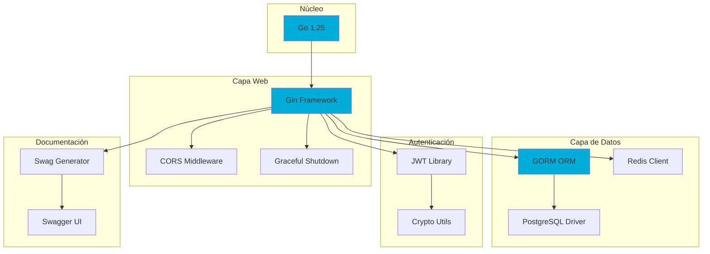

### Dependencias Principales

```go
require (
    github.com/gin-gonic/gin v1.10.0
    github.com/golang-jwt/jwt/v5 v5.3.0
    github.com/jackc/pgx/v5 v5.7.2
    github.com/redis/go-redis/v9 v9.13.0
    github.com/swaggo/http-swagger v1.6.0
    gorm.io/gorm v1.25.12
    golang.org/x/crypto v0.41.0
)
```

---

## Configuración y Setup

### Variables de Entorno

El proyecto utiliza variables de entorno para toda la configuración:

```bash
# Aplicación
APP_NAME=goprojectskeleton
APP_ENV=development
APP_PORT=8080
APP_VERSION=0.0.1
APP_DESCRIPTION=Go Project Skeleton
ENABLE_LOG=true
DEBUG_LOG=true

# Base de Datos
DB_HOST=localhost
DB_PORT=5432
DB_USER=postgres
DB_PASSWORD=postgres
DB_NAME=goprojectskeleton
DB_SSL=false

# Redis
REDIS_HOST=localhost:6379
REDIS_PASSWORD=
REDIS_DB=0
REDIS_TTL=300

# JWT
JWT_SECRET_KEY=your-secret-key
JWT_ISSUER=your-issuer
JWT_AUDIENCE=your-audience
JWT_ACCESS_TTL=3600
JWT_REFRESH_TTL=86400
JWT_CLOCK_SKEW=60

# Email
MAIL_HOST=localhost
MAIL_PORT=1025
MAIL_FROM=noreply@example.com
MAIL_PASSWORD=password

# Tokens y OTP
ONE_TIME_TOKEN_TTL=15
ONE_TIME_TOKEN_EMAIL_VERIFY_TTL=60
ONE_TIME_PASSWORD_LENGTH=6
ONE_TIME_PASSWORD_TTL=10
FRONTEND_RESET_PASSWORD_URL=http://localhost:3000/reset-password
FRONTEND_ACTIVATE_ACCOUNT_URL=http://localhost:3000/activate-account
```

### Instalación

1. **Clonar repositorio**
```bash
git clone <repository-url>
cd GoProjectSkeleton
```

2. **Configurar variables de entorno**
```bash
cp dev.env.example dev.env
# Editar dev.env con tus configuraciones
```

3. **Instalar dependencias**
```bash
go mod download
```

4. **Ejecutar con Docker**
```bash
# Crear red
docker network create goprojectskeleton

# Crear volumen
docker volume create goprojectskeleton-db-data

# Ejecutar servicios
docker-compose -f docker/docker-compose.dev.yml up -d
```

5. **Ejecutar aplicación**
```bash
go run src/infrastructure/api/cmd/main.go
```

---

## Módulos de Negocio

### 🔐 Módulo de Autenticación (`auth`)

**Responsabilidad**: Gestión completa de autenticación y autorización.

#### Funcionalidades

- ✅ **Login con Email/Contraseña** - Autenticación tradicional
- ✅ **Login con OTP** - Autenticación de dos factores
- ✅ **Refresh de Tokens** - Renovación de access tokens
- ✅ **Reset de Contraseña** - Recuperación mediante tokens
- ✅ **Validación de Usuario** - Verificación desde JWT token

#### Casos de Uso Detallados

**`JwtAuthUseCase`** - Autenticación principal
```go
// Flujo:
// 1. Valida credenciales (email/phone + password)
// 2. Verifica contraseña con hash
// 3. Si OTP activado → genera y envía OTP
// 4. Si OTP desactivado → genera tokens JWT
// 5. Retorna tokens o indica que se envió OTP
```

**`JwtAuthRefreshUseCase`** - Renovación de tokens
```go
// Flujo:
// 1. Valida refresh token
// 2. Verifica expiración y firma
// 3. Genera nuevo access token
// 4. Retorna nuevo token
```

**`JwtAuthOtpUseCase`** - Autenticación con OTP
```go
// Flujo:
// 1. Valida código OTP
// 2. Verifica expiración y uso
// 3. Invalida OTP usado
// 4. Genera tokens JWT
// 5. Retorna tokens
```

**`GetResetPasswordTokenUseCase`** - Generación de token de reset
```go
// Flujo:
// 1. Busca usuario por email/phone
// 2. Genera token único
// 3. Crea registro en BD con expiración
// 4. Envía email con link de reset
```

**`JwtAuthUserUseCase`** - Validación de usuario desde token
```go
// Flujo:
// 1. Extrae token del contexto
// 2. Valida y parsea token
// 3. Busca usuario en BD
// 4. Retorna usuario con rol
```

#### Pipes

**`GetResetPasswordPipe`** - Pipe para reset de contraseña
- Orquesta generación de token y envío de email
- Ejecución secuencial con manejo de errores

### 👥 Módulo de Usuarios (`user`)

**Responsabilidad**: Gestión completa del ciclo de vida de usuarios.

#### Funcionalidades

- ✅ **CRUD Completo** - Crear, leer, actualizar, eliminar
- ✅ **Activación de Cuentas** - Activación mediante tokens
- ✅ **Gestión de Roles** - Asignación y validación de roles
- ✅ **Paginación y Filtrado** - Consultas eficientes
- ✅ **Cache Inteligente** - Cache de listados con Redis
- ✅ **Emails Transaccionales** - Bienvenida y reactivación

#### Casos de Uso Detallados

**`CreateUserUseCase`** - Crear usuario básico
```go
// Flujo:
// 1. Valida datos de entrada
// 2. Verifica que email/phone no existan
// 3. Crea usuario con estado "pending"
// 4. Retorna usuario creado
```

**`CreateUserAndPasswordUseCase`** - Crear usuario con contraseña
```go
// Flujo:
// 1. Valida datos de usuario y contraseña
// 2. Hash de contraseña con Bcrypt
// 3. Crea usuario y contraseña en transacción
// 4. Retorna usuario creado
```

**`CreateUserSendEmailUseCase`** - Enviar email de bienvenida
```go
// Flujo:
// 1. Renderiza template de email
// 2. Envía email con datos del usuario
// 3. Maneja errores de envío
```

**`GetUserUseCase`** - Obtener usuario por ID
```go
// Flujo:
// 1. Valida ID
// 2. Busca usuario en BD
// 3. Incluye información de rol
// 4. Retorna usuario con rol
```

**`GetAllUserUseCase`** - Listar usuarios con filtros
```go
// Flujo:
// 1. Verifica cache (Redis)
// 2. Si cache hit → retorna desde cache
// 3. Si cache miss → consulta BD con filtros
// 4. Aplica paginación y ordenamiento
// 5. Guarda en cache con TTL
// 6. Retorna lista paginada
```

**`UpdateUserUseCase`** - Actualizar usuario
```go
// Flujo:
// 1. Valida datos de actualización
// 2. Busca usuario existente
// 3. Aplica cambios parciales (PATCH)
// 4. Valida reglas de negocio
// 5. Actualiza en BD
// 6. Retorna usuario actualizado
```

**`DeleteUserUseCase`** - Eliminar usuario (soft delete)
```go
// Flujo:
// 1. Busca usuario
// 2. Verifica permisos (no eliminar admin)
// 3. Soft delete (marca como deleted)
// 4. Invalida cache relacionado
```

**`ActivateUserUseCase`** - Activar cuenta de usuario
```go
// Flujo:
// 1. Valida token de activación
// 2. Verifica expiración
// 3. Cambia estado a "active"
// 4. Invalida token usado
```

**`ResendWelcomeEmailUseCase`** - Reenviar email de bienvenida
```go
// Flujo:
// 1. Busca usuario
// 2. Renderiza template
// 3. Envía email
```

#### Pipes

**`CreateUserPipe`** - Pipe para crear usuario completo
- Ejecuta secuencialmente:
  1. `CreateUserAndPasswordUseCase` → Crea usuario con contraseña
  2. `CreateUserSendEmailUseCase` → Envía email de bienvenida
- Manejo de errores: Si falla cualquier paso, se detiene la ejecución

### 🔑 Módulo de Contraseñas (`password`)

**Responsabilidad**: Gestión segura de contraseñas.

#### Funcionalidades

- ✅ **Creación de Contraseñas** - Hash seguro con Bcrypt
- ✅ **Generación de Tokens de Reset** - Tokens únicos con expiración
- ✅ **Validación de Fortaleza** - Reglas de contraseña segura
- ✅ **Expiración de Contraseñas** - Contraseñas temporales

#### Casos de Uso Detallados

**`CreatePasswordUseCase`** - Crear nueva contraseña
```go
// Flujo:
// 1. Valida fortaleza de contraseña
// 2. Hash con Bcrypt
// 3. Desactiva contraseñas anteriores
// 4. Crea nueva contraseña activa
// 5. Configura expiración si aplica
```

**`CreatePasswordTokenUseCase`** - Crear token de reset
```go
// Flujo:
// 1. Busca usuario por email/phone
// 2. Genera token único
// 3. Crea registro con expiración
// 4. Envía email con link de reset
```

#### Pipes

**`CreatePasswordTokenPipe`** - Pipe para reset de contraseña
- Orquesta creación de token y envío de email

### 📊 Módulo de Estado (`status`)

**Responsabilidad**: Monitoreo y salud del sistema.

#### Funcionalidades

- ✅ **Health Check** - Estado general del sistema
- ✅ **Verificación de Servicios** - BD, Redis, etc.
- ✅ **Información de Versión** - Versión de la aplicación

#### Casos de Uso Detallados

**`GetStatusUseCase`** - Obtener estado del sistema
```go
// Flujo:
// 1. Verifica conexión a PostgreSQL
// 2. Verifica conexión a Redis
// 3. Verifica providers (JWT, Email)
// 4. Retorna estado consolidado
// 5. Incluye información de versión
```

### 📈 Estadísticas por Módulo

| Módulo | Casos de Uso | Pipes | Tests | Endpoints |
|--------|--------------|-------|-------|-----------|
| **auth** | 5 | 1 | 5+ | 4 |
| **user** | 9 | 1 | 9+ | 7 |
| **password** | 2 | 1 | 2+ | 2 |
| **status** | 1 | 0 | 1+ | 1 |
| **Total** | **17** | **3** | **17+** | **14** |

---

## API y Endpoints

### Autenticación

| Método | Endpoint | Descripción | Autenticación |
|--------|----------|-------------|---------------|
| POST | `/api/auth/login` | Login con credenciales | No |
| POST | `/api/auth/refresh` | Renovar token de acceso | No |
| GET | `/api/auth/login-otp/{otp}` | Login con OTP | No |
| GET | `/api/auth/password-reset/{identifier}` | Solicitar reset de contraseña | No |

### Usuarios

| Método | Endpoint | Descripción | Autenticación |
|--------|----------|-------------|---------------|
| POST | `/api/user` | Crear usuario | No |
| GET | `/api/user/{id}` | Obtener usuario | Sí |
| PATCH | `/api/user/{id}` | Actualizar usuario | Sí |
| DELETE | `/api/user/{id}` | Eliminar usuario | Sí |
| GET | `/api/user` | Listar usuarios (con filtros) | Sí |
| POST | `/api/user-password` | Crear usuario con contraseña | No |
| POST | `/api/user/activate` | Activar usuario | No |

### Contraseñas

| Método | Endpoint | Descripción | Autenticación |
|--------|----------|-------------|---------------|
| POST | `/api/password` | Crear contraseña | Sí |
| POST | `/api/password/reset-token` | Crear token de reset | No |

### Sistema

| Método | Endpoint | Descripción | Autenticación |
|--------|----------|-------------|---------------|
| GET | `/api/health-check` | Health check | No |

**Nota**: La documentación Swagger está disponible como un servicio independiente en el puerto 8081 en `http://localhost:8081/docs/`

### Ejemplos de Uso

#### Login
```bash
curl -X POST http://localhost:8080/api/auth/login \
  -H "Content-Type: application/json" \
  -d '{
    "email": "user@example.com",
    "password": "password123"
  }'
```

#### Crear Usuario
```bash
curl -X POST http://localhost:8080/api/user \
  -H "Content-Type: application/json" \
  -d '{
    "name": "Juan Pérez",
    "email": "juan@example.com",
    "phone": "+1234567890",
    "role_id": 2,
    "status": "pending",
    "otpLogin": false
  }'
```

---

## Base de Datos y Persistencia

### Diagrama Entidad-Relación (ERD)

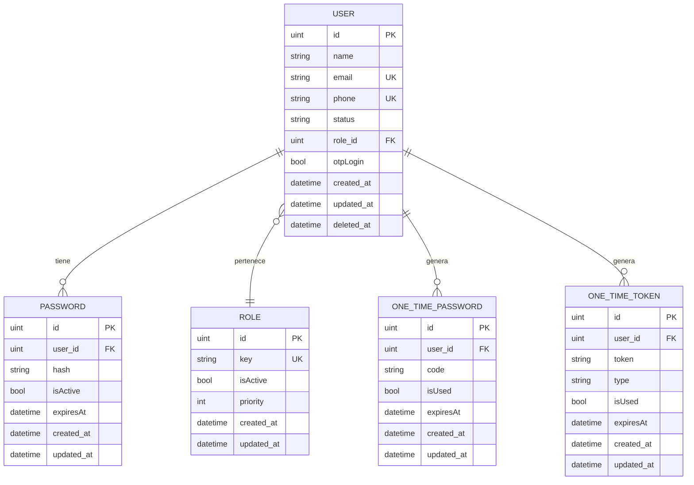

### Modelos Principales

#### User (Usuario)
```go
type User struct {
    ID        uint      `gorm:"primaryKey"`
    Name      string    `gorm:"not null"`
    Email     string    `gorm:"unique;not null"`
    Phone     string    `gorm:"not null"`
    Status    string    `gorm:"not null"`
    RoleID    uint      `gorm:"not null"`
    OTPLogin  bool      `gorm:"default:false"`
    CreatedAt time.Time
    UpdatedAt time.Time
    DeletedAt gorm.DeletedAt `gorm:"index"`
}
```

#### Password (Contraseña)
```go
type Password struct {
    ID        uint       `gorm:"primaryKey"`
    UserID    uint       `gorm:"not null"`
    Hash      string     `gorm:"not null"`
    IsActive  bool       `gorm:"default:true"`
    ExpiresAt *time.Time
    CreatedAt time.Time
    UpdatedAt time.Time
}
```

#### Role (Rol)
```go
type Role struct {
    ID          uint      `gorm:"primaryKey"`
    Key         string    `gorm:"unique;not null"`
    Name        string    `gorm:"not null"`
    Description string
    IsActive    bool      `gorm:"default:true"`
    Priority    int       `gorm:"default:0"`
    CreatedAt   time.Time
    UpdatedAt   time.Time
}
```

### Diagrama de Relaciones

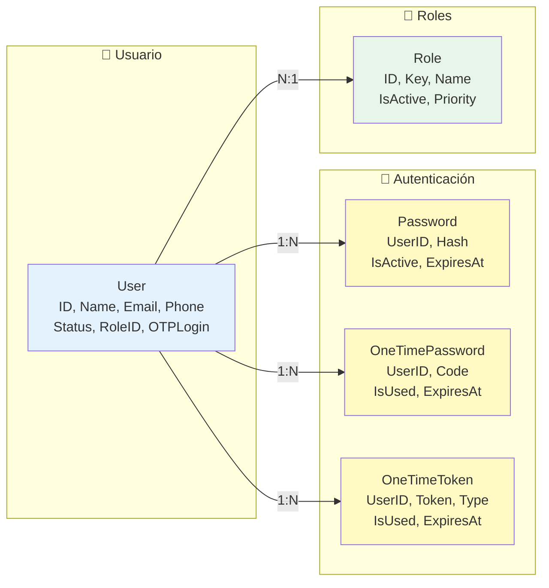

### Migraciones

Las migraciones se ejecutan automáticamente al iniciar la aplicación usando GORM AutoMigrate.

### Cache

El sistema utiliza Redis para cachear consultas frecuentes, especialmente en listados de usuarios.

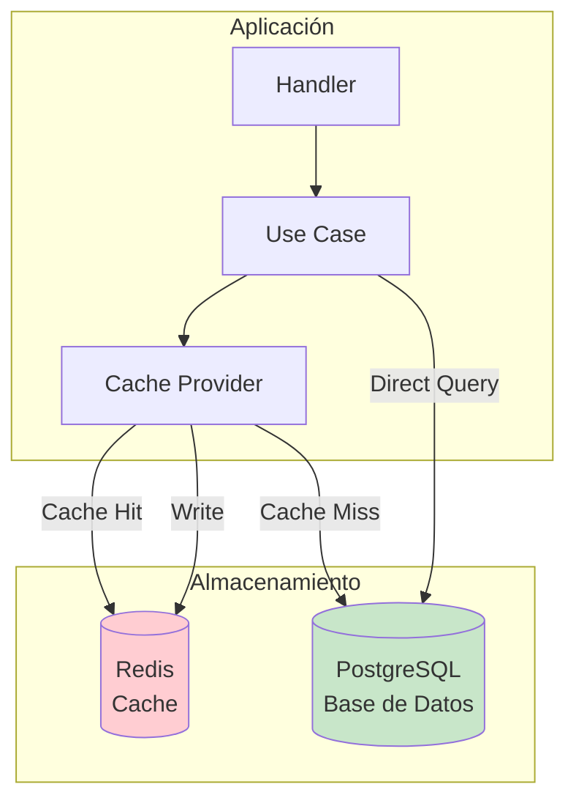

---

## Autenticación y Seguridad

### Diagrama de Flujo de Autenticación

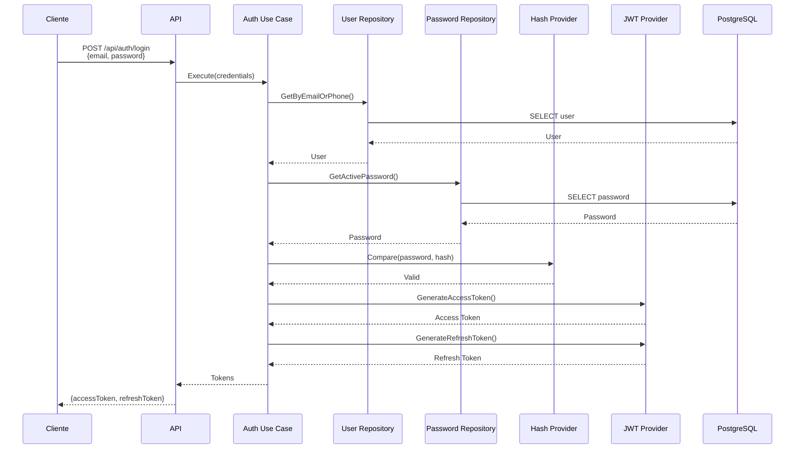

### Flujo de Autenticación con OTP

```mermaid
sequenceDiagram
    participant Client as Cliente
    participant API as API
    participant AuthUC as Auth Use Case
    participant OTPUC as OTP Use Case
    participant OTPRepo as OTP Repository
    participant EmailSvc as Email Service
    participant DB as PostgreSQL
    participant SMTP as SMTP

    Client->>API: POST /api/auth/login<br/>{email, password}
    API->>AuthUC: Execute(credentials)
    AuthUC->>AuthUC: Valida credenciales
    AuthUC->>AuthUC: ¿OTP Login activado?

    alt OTP Login activado
        AuthUC->>OTPUC: GenerateOTP()
        OTPUC->>OTPRepo: Create()
        OTPRepo->>DB: INSERT OTP
        OTPUC->>EmailSvc: SendOTPEmail()
        EmailSvc->>SMTP: Enviar email
        AuthUC-->>API: 204 No Content
        API-->>Client: OTP enviado por email
    else OTP Login desactivado
        AuthUC->>JWT: GenerateTokens()
        AuthUC-->>API: Tokens
        API-->>Client: {accessToken, refreshToken}
    end

    Note over Client,SMTP: Usuario ingresa OTP
    Client->>API: GET /api/auth/login-otp/{otp}
    API->>OTPUC: ValidateOTP(otp)
    OTPUC->>OTPRepo: GetByCode()
    OTPRepo->>DB: SELECT OTP
    OTPUC->>OTPUC: Valida expiración
    OTPUC->>JWT: GenerateTokens()
    OTPUC-->>API: Tokens
    API-->>Client: {accessToken, refreshToken}
```

### JWT (JSON Web Tokens)

El sistema utiliza JWT para autenticación con dos tipos de tokens:

```mermaid
graph TB
    subgraph TokenFlow["Flujo de Tokens"]
        Login[Login] --> AccessToken[Access Token<br/>TTL: 1 hora]
        Login --> RefreshToken[Refresh Token<br/>TTL: 24 horas]

        AccessToken -->|Expira| Refresh[Refresh Endpoint]
        Refresh --> NewAccess[New Access Token]

        AccessToken -->|Válido| Protected[Protected Resources]
    end

    subgraph TokenStructure["Estructura JWT"]
        Header[Header<br/>alg: HS256<br/>typ: JWT]
        Payload[Payload<br/>iss, aud, sub<br/>iat, exp, typ]
        Signature[Signature<br/>HMAC SHA256]

        Header --> JWT[JWT Token]
        Payload --> JWT
        Signature --> JWT
    end

    style AccessToken fill:#c8e6c9
    style RefreshToken fill:#fff9c4
    style Protected fill:#e3f2fd
```

1. **Access Token**: Token de acceso (TTL: 1 hora por defecto)
2. **Refresh Token**: Token de renovación (TTL: 24 horas por defecto)

### OTP (One-Time Password)

Sistema de autenticación de dos factores:

```mermaid
stateDiagram-v2
    [*] --> Login: Credenciales
    Login --> CheckOTP: Validar
    CheckOTP --> GenerateOTP: OTP activado
    CheckOTP --> GenerateJWT: OTP desactivado

    GenerateOTP --> SendEmail: Código generado
    SendEmail --> WaitOTP: Email enviado
    WaitOTP --> ValidateOTP: Usuario ingresa código
    ValidateOTP --> GenerateJWT: Código válido
    ValidateOTP --> Expired: Código expirado
    ValidateOTP --> Invalid: Código inválido

    GenerateJWT --> [*]: Tokens generados
    Expired --> [*]
    Invalid --> [*]
```

- Generación automática de códigos OTP
- Envío por email
- TTL configurable (por defecto: 10 minutos)

### Seguridad

```mermaid
graph TB
    subgraph SecurityLayers["Capas de Seguridad"]
        Input[Input Validation<br/>DTOs]
        Auth[Authentication<br/>JWT Middleware]
        Authz[Authorization<br/>Guards/Roles]
        Hash[Password Hashing<br/>Bcrypt]
        CORS[CORS<br/>Cross-Origin]
        Sanitize[Sanitization<br/>SQL Injection]
    end

    Request[HTTP Request] --> Input
    Input --> Auth
    Auth --> Authz
    Authz --> BusinessLogic[Business Logic]

    Password[Password] --> Hash
    Hash --> Storage[(Database)]

    Request --> CORS
    Request --> Sanitize

    style Input fill:#e3f2fd
    style Auth fill:#fff9c4
    style Authz fill:#f3e5f5
    style Hash fill:#c8e6c9
```

- **Hash de contraseñas**: Bcrypt con salt automático
- **Validación de entrada**: En todos los endpoints
- **Middleware de autenticación**: Para rutas protegidas
- **CORS**: Configurado para seguridad web
- **Sanitización**: Prevención de inyecciones

---

## Testing

### Estructura de Tests

```
tests/
├── e2e/                    # Tests end-to-end
│   ├── collection.json     # Postman collection
│   └── environment.json    # Postman environment
└── integration/            # Tests de integración
    ├── main_test.go        # Setup de tests
    ├── user_repository_test.go
    ├── password_repository_test.go
    └── email_provider_test.go
```

### Tipos de Testing

1. **Unit Tests**: Tests de unidades individuales (en cada módulo)
2. **Integration Tests**: Tests de integración con base de datos
3. **E2E Tests**: Tests end-to-end con Postman

### Ejecutar Tests

```bash
# Tests unitarios
go test ./src/...

# Tests de integración
go test ./tests/integration/...

# Tests E2E (requiere servicios corriendo)
# Usar Postman collection en tests/e2e/
```

---

## Docker y Despliegue

### Arquitectura Docker

```mermaid
graph TB
    subgraph DockerNetwork["Docker Network: goprojectskeleton"]
        subgraph AppContainer["Aplicación Go"]
            App[Go Application<br/>Port: 8080<br/>Hot Reload]
        end

        subgraph DBServices["Servicios de Datos"]
            PostgreSQL[(PostgreSQL<br/>Port: 5432<br/>Volume: db-data)]
            Redis[(Redis<br/>Port: 6379<br/>Cache)]
        end

        subgraph SwaggerService["Servicio Swagger Independiente"]
            Swagger[Swagger Server<br/>Port: 8081<br/>Independent]
        end

        subgraph DevTools["Herramientas de Desarrollo"]
            Mailpit[Mailpit<br/>Port: 8025<br/>Email Testing]
            RedisCommander[Redis Commander<br/>Port: 18081<br/>Redis UI]
        end
    end

    App -->|GORM| PostgreSQL
    App -->|go-redis| Redis
    App -->|SMTP| Mailpit

    Swagger -.->|Documentation| App
    RedisCommander -->|UI| Redis

    style App fill:#e3f2fd
    style PostgreSQL fill:#c8e6c9
    style Redis fill:#ffcdd2
    style Mailpit fill:#fff9c4
    style RedisCommander fill:#f3e5f5
```

### Diagrama de Despliegue

```mermaid
graph TB
    subgraph Dev["🛠️ Desarrollo"]
        DevApp[Go App<br/>Hot Reload]
        DevDB[(PostgreSQL<br/>Dev)]
        DevRedis[(Redis<br/>Dev)]
        DevMail[Mailpit]
    end

    subgraph Test["🧪 Testing"]
        TestApp[Go App<br/>Test Mode]
        TestDB[(PostgreSQL<br/>Test)]
        TestRedis[(Redis<br/>Test)]
    end

    subgraph Prod["🚀 Producción"]
        LB[Load Balancer]
        App1[App Instance 1]
        App2[App Instance 2]
        App3[App Instance N]
        ProdDB[(PostgreSQL<br/>Primary)]
        ProdDBReplica[(PostgreSQL<br/>Replica)]
        ProdRedis[(Redis<br/>Cluster)]
        ProdSMTP[SMTP Server]
    end

    LB --> App1
    LB --> App2
    LB --> App3

    App1 --> ProdDB
    App2 --> ProdDB
    App3 --> ProdDB

    App1 --> ProdDBReplica
    App2 --> ProdDBReplica
    App3 --> ProdDBReplica

    App1 --> ProdRedis
    App2 --> ProdRedis
    App3 --> ProdRedis

    App1 --> ProdSMTP
    App2 --> ProdSMTP
    App3 --> ProdSMTP

    style Dev fill:#e1f5ff
    style Test fill:#fff4e1
    style Prod fill:#e8f5e9
```

### Servicios Docker

El proyecto incluye configuración Docker para desarrollo:

- **Aplicación**: Servidor Go con hot reload (puerto 8080)
- **Swagger**: Servicio independiente de documentación (puerto 8081)
- **PostgreSQL**: Base de datos principal
- **Redis**: Cache y sesiones
- **Mailpit**: Servidor de email para desarrollo
- **Redis Commander**: Interfaz web para Redis (puerto 18081)

### Comandos Docker

```bash
# Desarrollo
docker-compose -f docker/docker-compose.dev.yml up -d

# Testing
docker-compose -f docker/docker-compose.test.yml up -d

# E2E Testing
docker-compose -f docker/docker-compose.e2e.yml up -d
```

### Despliegue Independiente de Swagger

El servicio Swagger puede desplegarse completamente independiente de la aplicación principal:

#### Construcción de la Imagen

```bash
# Construir imagen de Swagger
docker build -f docker/dockerfile.swagger -t your-registry/swagger:latest .

# Etiquetar para versión específica
docker tag your-registry/swagger:latest your-registry/swagger:v1.0.0
```

#### Push a Docker Registry

```bash
# Push a Docker Hub
docker push your-registry/swagger:latest

# Push a otros registries (ej: AWS ECR, Google GCR, Azure ACR)
# AWS ECR
aws ecr get-login-password --region us-east-1 | docker login --username AWS --password-stdin <account-id>.dkr.ecr.us-east-1.amazonaws.com
docker tag your-registry/swagger:latest <account-id>.dkr.ecr.us-east-1.amazonaws.com/swagger:latest
docker push <account-id>.dkr.ecr.us-east-1.amazonaws.com/swagger:latest
```

#### Ejecución del Contenedor

```bash
# Ejecutar con variables de entorno
docker run -d \
  -p 8081:8081 \
  -e SWAGGER_PORT=8081 \
  -e API_HOST=api.example.com:8080 \
  -e API_TITLE="Mi Documentación API" \
  -e API_VERSION="1.0" \
  -e API_DESCRIPTION="Documentación de la API" \
  -e API_BASE_PATH="/api" \
  --name swagger-docs \
  your-registry/swagger:latest

# O usando un archivo .env
docker run -d \
  -p 8081:8081 \
  --env-file swagger.env \
  --name swagger-docs \
  your-registry/swagger:latest
```

#### Despliegue en Kubernetes

```yaml
apiVersion: apps/v1
kind: Deployment
metadata:
  name: swagger-docs
spec:
  replicas: 1
  selector:
    matchLabels:
      app: swagger-docs
  template:
    metadata:
      labels:
        app: swagger-docs
    spec:
      containers:
      - name: swagger
        image: your-registry/swagger:latest
        ports:
        - containerPort: 8081
        env:
        - name: SWAGGER_PORT
          value: "8081"
        - name: API_HOST
          value: "api.example.com:8080"
        - name: API_TITLE
          value: "Mi Documentación API"
---
apiVersion: v1
kind: Service
metadata:
  name: swagger-docs-service
spec:
  selector:
    app: swagger-docs
  ports:
  - protocol: TCP
    port: 80
    targetPort: 8081
  type: LoadBalancer
```

#### Ventajas del Despliegue Independiente

- ✅ **Escalabilidad independiente**: Escalar Swagger sin afectar la aplicación principal
- ✅ **Actualizaciones sin downtime**: Actualizar documentación sin reiniciar la API
- ✅ **Separación de responsabilidades**: Documentación separada de la lógica de negocio
- ✅ **Diferentes entornos**: Diferentes versiones de documentación para dev/staging/prod
- ✅ **CDN y caching**: Servir documentación desde CDN para mejor rendimiento

---

## Guía de Desarrollo

### Agregar Nueva Funcionalidad

#### Diagrama de Flujo para Agregar Funcionalidad

```mermaid
flowchart TD
    Start([Nueva Funcionalidad]) --> Domain[1. Domain Layer<br/>Crear Modelo]
    Domain --> Contracts[2. Application Contracts<br/>Definir Interfaces]
    Contracts --> UseCase[3. Application Use Case<br/>Implementar Lógica]
    UseCase --> Repo[4. Infrastructure Repository<br/>Implementar con GORM]
    Repo --> Handler[5. Infrastructure Handler<br/>Adaptar HTTP]
    Handler --> Route[6. Routes<br/>Definir Endpoint]
    Route --> Tests[7. Tests<br/>Escribir Tests]
    Tests --> End([✅ Completado])

    style Domain fill:#e8f5e9
    style Contracts fill:#fff9c4
    style UseCase fill:#e3f2fd
    style Repo fill:#f3e5f5
    style Handler fill:#ffebee
    style Route fill:#e1f5ff
    style Tests fill:#fff4e1
```

#### Pasos Detallados

1. **Crear modelo en `domain/models/`**
```go
type NewEntity struct {
    // Campos
}
```

2. **Definir interfaz en `application/contracts/repositories/`**
```go
type INewEntityRepository interface {
    Create(input NewEntityCreate) (*NewEntity, error)
    // Más métodos
}
```

3. **Implementar caso de uso en `application/modules/newmodule/use_cases/`**
```go
type CreateNewEntityUseCase struct {
    repo INewEntityRepository
}

func (uc *CreateNewEntityUseCase) Execute(...) *UseCaseResult[NewEntity] {
    // Lógica de negocio
}
```

4. **Crear repositorio en `infrastructure/repositories/`**
```go
type NewEntityRepository struct {
    RepositoryBase[...]
}

func (r *NewEntityRepository) Create(...) (*NewEntity, error) {
    // Implementación con GORM
}
```

5. **Agregar handler en `infrastructure/handlers/`**
```go
func CreateNewEntity(ctx HandlerContext) {
    // Adaptar HTTP a caso de uso
}
```

6. **Definir ruta en `infrastructure/api/routes/router.go`**
```go
r.POST("/new-entity", wrapHandler(handlers.CreateNewEntity))
```

7. **Escribir tests**

### Convenciones de Código

- **Nombres**: camelCase para variables, PascalCase para tipos
- **Comentarios**: Documentar funciones públicas
- **Errores**: Usar el sistema de errores centralizado
- **Logging**: Usar el logger centralizado
- **Validación**: Validar entrada en todos los endpoints

---

## 🎯 Mejores Prácticas y Convenciones

### Convenciones de Código

#### Nomenclatura
- **Variables**: `camelCase` (ej: `userName`, `isActive`)
- **Tipos y Structs**: `PascalCase` (ej: `User`, `UserRepository`)
- **Interfaces**: `I` + `PascalCase` (ej: `IUserRepository`, `IHashProvider`)
- **Constantes**: `UPPER_SNAKE_CASE` (ej: `USER_STATUS_ACTIVE`)
- **Paquetes**: `lowercase` (ej: `user`, `auth`)

#### Estructura de Archivos
- **Use Cases**: `{action}_{entity}.go` (ej: `create_user.go`, `get_user.go`)
- **Repositories**: `{entity}.go` (ej: `user.go`, `password.go`)
- **Handlers**: `{entity}.go` o `{module}.go` (ej: `user.go`, `auth.go`)
- **Tests**: `{file}_test.go` (ej: `create_user_test.go`)

#### Organización de Código
```go
// 1. Imports (std, third-party, local)
import (
    "context"
    "fmt"

    "github.com/gin-gonic/gin"

    "goprojectskeleton/src/domain/models"
)

// 2. Types y Structs
type UserRepository struct {
    // ...
}

// 3. Constructors
func NewUserRepository(...) *UserRepository {
    // ...
}

// 4. Métodos públicos
func (r *UserRepository) Create(...) {
    // ...
}

// 5. Métodos privados
func (r *UserRepository) validate(...) {
    // ...
}
```

### Principios de Diseño Aplicados

#### 1. Single Responsibility Principle (SRP)
Cada componente tiene una única responsabilidad:
- **Use Cases**: Lógica de negocio específica
- **Repositories**: Acceso a datos
- **Handlers**: Adaptación HTTP
- **Providers**: Servicios externos

#### 2. Dependency Inversion Principle (DIP)
Las capas internas definen interfaces que las externas implementan:
```go
// Application define la interfaz
type IUserRepository interface {
    Create(input UserCreate) (*User, error)
}

// Infrastructure implementa la interfaz
type UserRepository struct {
    DB *gorm.DB
}
```

#### 3. Open/Closed Principle (OCP)
Abierto para extensión, cerrado para modificación:
- Nuevos providers sin modificar código existente
- Nuevos casos de uso sin afectar otros
- Nuevos repositorios siguiendo interfaces

#### 4. Interface Segregation Principle (ISP)
Interfaces específicas y pequeñas:
```go
// En lugar de una interfaz grande
type IProvider interface {
    // 50 métodos...
}

// Interfaces específicas
type IHashProvider interface {
    Hash(password string) (string, error)
    Compare(hashed, plain string) bool
}
```

#### 5. Don't Repeat Yourself (DRY)
Reutilización mediante:
- `RepositoryBase` para operaciones CRUD comunes
- `BaseUseCaseValidation` para validación común
- Servicios compartidos en `application/shared/services`

### Manejo de Errores

#### Estructura de Errores
```go
type ApplicationError struct {
    Code    status.ApplicationStatusCode
    Context string
    ErrMsg  string
}
```

#### Estrategia de Errores
1. **Domain Layer**: Errores de negocio (validaciones)
2. **Application Layer**: Errores de aplicación (`ApplicationError`)
3. **Infrastructure Layer**: Errores técnicos (mapeados a `ApplicationError`)

### Logging

#### Niveles de Logging
- **Info**: Información general del flujo
- **Error**: Errores que requieren atención
- **Debug**: Información detallada para debugging
- **Panic**: Errores críticos que detienen la aplicación

#### Ejemplo de Uso
```go
providers.Logger.Info("User created successfully", map[string]interface{}{
    "user_id": user.ID,
    "email": user.Email,
})

providers.Logger.Error("Failed to create user", err)
```

### Testing

#### Estructura de Tests
```go
func TestCreateUser(t *testing.T) {
    // Arrange
    mockRepo := &MockUserRepository{}
    useCase := NewCreateUserUseCase(logger, mockRepo)

    // Act
    result := useCase.Execute(ctx, locale, input)

    // Assert
    assert.NoError(t, result.Error)
    assert.NotNil(t, result.Data)
}
```

#### Tipos de Tests
1. **Unit Tests**: Casos de uso con mocks
2. **Integration Tests**: Repositorios con BD real
3. **E2E Tests**: Flujos completos con Postman

## Conclusión

**GoProjectSkeleton** proporciona una base sólida, escalable y mantenible para desarrollar aplicaciones empresariales en Go. La arquitectura Clean Architecture, junto con patrones de diseño avanzados, proporciona una base excelente para el crecimiento del sistema.

### 🎯 Puntos Fuertes

- ✅ **Arquitectura sólida** y bien estructurada
- ✅ **Escalabilidad** horizontal y vertical
- ✅ **Serverless ready** - Fácil migración a serverless (AWS Lambda, Azure Functions)
- ✅ **Testing completo** en múltiples capas
- ✅ **Documentación** exhaustiva con Swagger
- ✅ **Docker completo** para desarrollo y producción
- ✅ **Multi-cloud** - Soporte para AWS y Azure
- ✅ **Seguridad** - JWT, OTP, hash seguro de contraseñas
- ✅ **Internacionalización** - Soporte multiidioma
- ✅ **Optimización** - Cache, tree shaking, connection pooling

### 🚀 Casos de Uso Ideales

- **APIs RESTful** empresariales
- **Microservicios** escalables
- **Aplicaciones Serverless** (AWS Lambda, Azure Functions)
- **Sistemas de autenticación** robustos
- **APIs con alta concurrencia**
- **Proyectos que requieren mantenibilidad** a largo plazo

### 📚 Próximos Pasos

1. **Explorar la Documentación**
   - Revisar Swagger en `http://localhost:8081/docs/` (servicio independiente)
   - Leer ejemplos de código en cada módulo

2. **Ejecutar Tests**
   ```bash
   go test ./src/...
   go test ./tests/integration/...
   ```

3. **Adaptar a tus Necesidades**
   - Personalizar modelos de dominio
   - Agregar nuevos módulos de negocio
   - Configurar providers según tus servicios

4. **Desplegar**
   - Desarrollo: Docker Compose
   - Producción: Monolito tradicional o Serverless
   - Cloud: AWS Lambda o Azure Functions

### 🤝 Contribuciones

Este proyecto sigue las mejores prácticas de Go y arquitectura limpia. Al contribuir:

1. Mantén la separación de capas
2. Sigue las convenciones de código
3. Escribe tests para nuevas funcionalidades
4. Documenta cambios importantes
5. Actualiza Swagger para nuevos endpoints

### 📞 Soporte

Para más información:
- **Documentación Swagger**: `http://localhost:8081/docs/` (servicio independiente)
- **Tests de Ejemplo**: `tests/`
- **Código Fuente**: Explora `src/` para ver implementaciones

---

<div align="center">
  <p>Hecho con ❤️ usando Go y Clean Architecture</p>
  <p>⭐ Si este proyecto te es útil, considera darle una estrella</p>
</div>
